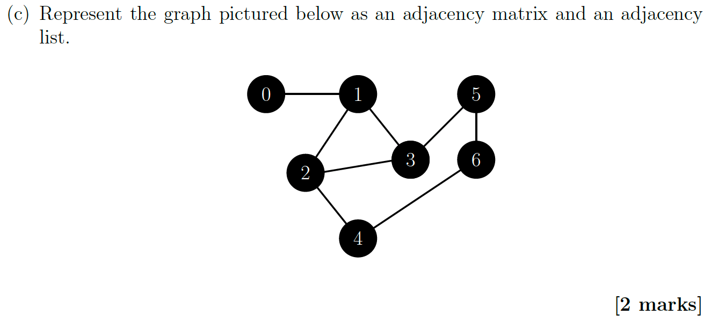
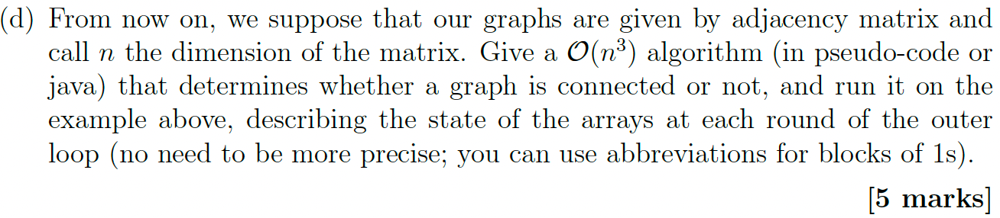
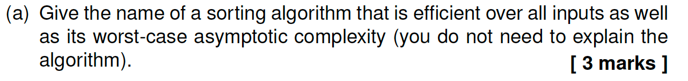
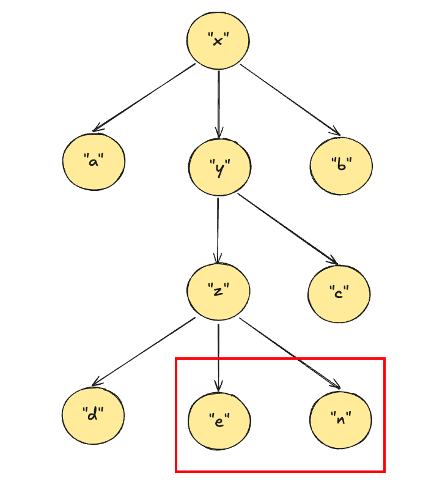

# CSCM12  2022

## Question1: Code Tracing and Complexity (12 marks)


> (**First, analyze the Question**)
>
> * "the number of occurrences of a single char (denoted as ψ) in the array is ==always== more than half (>N/2)"
>
> * "Your task is to find ψ"  
>   * No use of "if exists" or similar conditional qualifiers
> * All the examples given clearly show that ψ exists and there is no "non-existence" case.
> * "You are not told what character ψ is..."
>   * (I won't tell you what ψ is...) This statement implies that ψ must exist, but its specific characteristics are unknown.

### Question1-(a)


#### *Suggested answer*

**(First, analyze the code)** 

The structure of the function is a triple-nested loop:

1. **Outermost loop (`k` loop)**: We notice that the loop variable `k` is completely unused and can be removed without affecting the result.  
   - Iterates over array `A`, with the number of iterations being `n` (`A.length`).  
   - Time complexity: **O(n)**.  
2. **Middle loop (`i` loop)**:  
   - For each `k`, it iterates over array `A` again, with the number of iterations being `n`.  
   - Time complexity: **O(n)** (nested within the outer loop, so `O(n) * O(n) = O(n²)`).  
3. **Innermost loop (`j` loop)**:  
   - For each `i`, it iterates over array `A` a third time, with the number of iterations being `n`.  
   - Time complexity: **O(n)** (nested within the first two loops, so `O(n) * O(n) * O(n) = O(n³)`).  

Impact of Other Operations  

- `if (A[i] == A[j])` and `count++` are **O(1)** operations and do not affect the overall complexity.  
- `if (count > max_count)` and updating `candidate` are also **O(1)** operations.  

Total Time Complexity  
$$
O(n) \times O(n) \times O(n) = O(n^3)
$$

### Question1-(b)


> **(First, analyze the Question)**
>
> The problem requires writing a piece of Java code or pseudocode that satisfies the following conditions:
>
> - **Space Complexity**:
>   - Must be **O(1)** (constant space, without using additional storage structures such as arrays or hash tables).
> - **Time Complexity**: 
>   - Should be as efficient as possible, **asymptotically faster** (i.e., optimized in terms of Big-O notation, not just constant-factor optimizations). ==This means that it is smaller than $ O(n^3)$ in Question1-(a).==
>   - The optimal time complexity (e.g., linear time **O(n)**) can earn the full score of 6 points.
>
>
> 📍**So our goal is to solve the problem in the title, the space complexity is constant $O(1)$, and the time complexity is less than $O(n^3)$, which can be  $ O(n^2logn)$  $ O(n^2)$  $ O(nlogn)$  $ O(n)$**  

#### *Simple Suggested answer 1 -- $(n^2)$*

We notice that the loop variable `k` is completely unused and can be removed without affecting the result. 

```java
public static void find_element(char[] A) {
    char candidate = '0';
    int max_count = 0;
//        for (int k = 0; k < A.length; k++) {
    for (int i = 0; i < A.length; i++) {
        int count = 0;
        for (int j = 0; j < A.length; j++) {
            if (A[i] == A[j]) {
                count++;
            }
        }
        if (count > max_count) {
            candidate = A[i];
            max_count = count;
        }
    }
//        }
    System.out.println(candidate);
}
```

#### *Simple Suggested answer 2* -- $(n)$

==Boyer-Moore Voting Algorithm(摩尔投票算法)==

**1. Purpose**

To find the **majority element** in an array that appears **more than ⌊n/2⌋ times**.

**2. Key Idea**

- **Cancellation Mechanism**: Different elements cancel each other out, and the remaining candidate must be the majority element.
- **Mathematical Guarantee**: Since the majority element appears > N/2 times, it cannot be fully canceled out.

**3. Algorithm Steps**

1. **Initialization**: `candidate = null`, `count = 0`
2. **Traverse the array**:
   - If `count == 0`, set `candidate = current element` and `count = 1`
   - If `current element == candidate`, increment `count++`
   - Otherwise, decrement `count--` (cancel out)
3. **Final Result**: `candidate` is the majority element (no need for verification if guaranteed to exist).

**4. Time & Space Complexity**

- **Time Complexity**: O(n) (just one traverse)
- **Space Complexity**: O(1) (only two variables used)

```java
public static void findMajorityElement(char[] A) {
    char candidate = '0'; 
    int count = 0;
    
    // Boyer-Moore Voting Algorithm
    for (int i = 0; i < A.length; i++) {
        char c = A[i];
        if (count == 0) {
            candidate = c;
            count = 1;
        } else if (c == candidate) {
            count++;
        } else {
            //cancel out
            count--;
        }
    }
    
    System.out.println(candidate);
}
```

```java
FUNCTION findMajorityElement(A: array of characters) -> character:
    // Initialize candidate and counter
    candidate ← '0'  // or any default value
    count ← 0
    
    // Traverse the array
    FOR i FROM 0 TO LENGTH(A) - 1 DO:
        current_char ← A[i]
        
        // Voting process
        IF count == 0 THEN:
            candidate ← current_char
            count ← 1
        ELSE IF current_char == candidate THEN:
            count ← count + 1
        ELSE:
            count ← count - 1  // Cancel out
        END IF
    END FOR
    
    // Since the majority element is guaranteed to exist, return candidate
    RETURN candidate
END FUNCTION
```

### Question1-(c)


> The above has been made clear enough.

## **Question 2:** Recursion and Trees (20 marks) 

### Question2-(a)


#### *Suggested answer*

1. **Binary Tree** (2 marks):
   A binary tree is a tree data structure where each node has at most two children (left and right child). No specific order of node values is required.
2. **Binary Search Tree** (2 marks):
   A binary search tree is a special binary tree that satisfies:
   - Value of any node > all values in its left subtree
   - Value of any node < all values in its right subtree
   - Both subtrees must also be BSTs

> The definition of BST does not allow the same node value to exist, it must be strictly greater than or less than.

```code
// Binary Tree
  10896
   /  \
  29   3
 / \
4   5

// Binary Search Tree
       40
    /      \
   21     60
  / \     / \
 1  32 54 89
```

### Question2-(b)


> (**First, analyze the Question**)
>
> Note the difference between a binary search tree and a binary tree.

#### *Suggested answer*

```java
// for BST

public int max(Node t) {
    // Iterative approach to find max in BST
    // Since BST properties guarantee max is the rightmost node
    while (t.right != null) {
        t = t.right; // Keep moving to right subtree
    }
    return t.value; // Rightmost node's value is the max
    
    /*
    Alternative recursive approach:
    if (t.right == null) { // Base case: no more right nodes
        return t.value;
    }
    return max(t.right); // Recursively check right subtree
    */
}

FUNCTION max(Node t) --> int:
    IF t is null:
        THROW "Empty tree"
        
    WHILE t.right exists:
        t = t.right
    RETURN t.value
END FUNCTION
```

```java
// for BT

// For ordinary binary trees, since the node values do not have the sorting property of small on the left and large on the right, all nodes must be traversed to determine the maximum value.
public int max(Node t) {    
    // Recursively traverse all nodes
    int currentMax = t.value;
    if (t.left != null) {
        currentMax = Math.max(currentMax, max(t.left)); //Recursively left tree
    }
    if (t.right != null) {
        currentMax = Math.max(currentMax, max(t.right)); //Recursively right tree
    }
    return currentMax;
}

//Iteration using stack
public int max(Node t) {
	int maxValue = Integer.MIN_VALUE;
    Stack<Node> stack = new Stack<>();
    stack.push(t);
    
    while (!stack.isEmpty()) {
        Node node = stack.pop();
        maxValue = Math.max(maxValue, node.value);
        
        if (node.right != null) 
          stack.push(node.right);
        if (node.left != null) 
          stack.push(node.left);
    }
    return maxValue;
}
```

### Question2-(c)


#### *Suggest answer*

> Tree A leaf nodes（right→left）: 6 7 4 
> Tree B leaf nodes（right→left）: 10 9 8 11 4 

**It recursively prints leaf nodes from right to left.**

### Question2-(d)


#### *Suggest answer*

```java
public void deSerialise(ArrayList<String> list) {
    this.root = deSerialiseRecursive(list);
}

private Node deSerialiseRecursive(ArrayList<String> list) {
    if (list.isEmpty()) 
      return null;

    String val = list.remove(0);
    if (val.equals("$")) {
        return null;
    }

    Node node = new Node(Integer.parseInt(val));
    node.left = deSerialiseRecursive(list);
    node.right = deSerialiseRecursive(list);
    return node;
}
```

## Question 3: Advanced Application (10 marks)

### Question3-(a)


#### Suggest answer

> 1. **Time complexity** is always $O(n log n)$, suitable for **external sorting** (e.g., disk files).
> 2. **Stable sorting**, preserving the original order of equal elements.

### Question3-(b)


#### Suggest answer

1. **Purpose**: Traversal algorithms systematically visit all nodes in a graph to analyze or search data (e.g., finding paths).
2. **BFS**: Explores nodes level-by-level using a queue, ensuring shortest-path discovery in **unweighted graphs**.
3. **BFS vs. DFS**: BFS guarantees the shortest path in unweighted graphs; DFS cannot without additional steps.

### Question3-(c)


#### Suggest answer

* trainee failed to complete the task: The graph shows that the running time increases exponentially with the number of intersections, which does not meet the characteristics of an efficient algorithm (it should be linear like BFS or DFS). 
* Key evidence: When the number of intersections increases from 1k to 2k, the time soars from ≈2.5ms to ≈17.5ms, which is much faster than linear growth (if the efficient algorithm is such as BFS, the growth rate should be flat).

## Question4: Hashtable Application (8 marks)


### Suggest answer

```java
import java.util.HashMap;

public class StringSubtract {
    public static void main(String[] args) {
        String str1 = args[0];
        String str2 = args[1];
      
        HashMap<Character, Integer> times = new HashMap<>();
        for (int i = 0; i < str2.length(); i++) {
            char ch = str2.charAt(i);
            times.put(ch, 1);
        }
        String result = "";
        for (int i = 0; i < str1.length(); i++) {
            char ch = str1.charAt(i);
            if (!times.containsKey(ch)) {
                result += ch;
            }
        }
        System.out.println(result);
    }
}
```

---

# CSCM12  2023

## Question1: Graph algorithms (17 marks)


### Question1-(a)


> n(n-1)/2

### Question1-(b)


#### Suggest answer

1. **Adjacency List**:
   - Stores each vertex's neighbors using linked lists or dynamic arrays
   - *Space complexity*: O(V + E), ideal for **sparse graphs** (where E << V²)
2. **Adjacency Matrix**:
   - Represents edges in a V×V binary matrix (1 for connected, 0 otherwise)
   - *Space complexity*: O(V²), suits **dense graphs** (where E ≈ V²)
3. **Graph Class Where Adjacency List Wins** (1 mark):
   - **Sparse graphs** (e.g., social networks, web link graphs, trees)

### Question1-(c)



#### Suggest answer

```java
// adjacency matrix
   0 1 2 3 4 5 6
0 [0,1,0,0,0,0,0]
1 [1,0,1,1,0,0,0]
2 [0,1,0,1,1,0,0]
3 [0,1,1,0,0,1,0]
4 [0,0,1,0,0,0,1]
5 [0,0,0,1,0,0,1]
6 [0,0,0,0,1,1,0]
    
     
//adjacency list
0 → [1]
1 → [0,2,3]
2 → [1,3,4]
3 → [1,2,5]
4 → [2,6]
5 → [3,6]
6 → [4,5]

  List<List<Integer>> adjacencyList = new ArrayList<>();
  adjacencyList.add(List.of(1));         // 节点0
  adjacencyList.add(List.of(0, 2, 3)); // 节点1
  adjacencyList.add(List.of(1, 3, 4));      // 节点2
  adjacencyList.add(List.of(1, 2, 5));   // 节点3
  adjacencyList.add(List.of(2, 6));      // 节点4
  adjacencyList.add(List.of(3, 6));      // 节点5
  adjacencyList.add(List.of(4, 5));      // 节点6
```

### Question1-(d)



> $O(n^3)$ ---> Floyd algorithm

#### Suggest answer

```java
public class GraphConnectivityChecker {
    
    public static boolean isConnected(int[][] adjMatrix) {
        int n = adjMatrix.length;
        // 创建可达性矩阵（初始化为邻接矩阵的拷贝）
        int[][] reachability = new int[n][n];
        for (int i = 0; i < n; i++) {
            for (int j = 0; j < n; j++) {
                reachability[i][j] = adjMatrix[i][j];
            }
        }

        // Floyd-Warshall算法核心
        for (int k = 0; k < n; k++) {          // 中间节点k
           printMatrixState(reachability, k);  // 打印每次迭代后的状态
			for (int i = 0; i < n; i++) {      // 起始节点i
                for (int j = 0; j < n; j++) {  // 目标节点j
                    // 检查是否通过k节点建立新连接
                    if (reachability[i][k] == 1 && reachability[k][j] == 1) {
                        reachability[i][j] = 1;
                    }
                }
            }
        }

        // 检查最终可达性
        for (int i = 0; i < n; i++) {
            for (int j = 0; j < i; j++) {
                if (reachability[i][j] == 0) {
                    return false;
                }
            }
        }
        return true;
    }
  
    private static void printMatrixState(int[][] matrix, int iteration) {
          System.out.println("迭代 k=" + iteration + " 后的可达性矩阵:");
          for (int[] row : matrix) {
              for (int val : row) {
                  System.out.print(val + " ");
              }
              System.out.println();
          }
          System.out.println("-------------------");
      }
}
```

### Question1-(e)


#### Suggest answer

```java
public class GraphConnectivityTimeFinder {

    /**
     * 找出图变为连通图的最早时间t
     * @param adjMatrix 邻接矩阵（n×n）
     * @param edgeTime 边权矩阵（edgeTime[i][j]表示边i-j的可用时间）
     * @param tEnd 最大边权值
     * @return 最早连通时间（若无解返回Integer.MAX_VALUE）
     */
    public static int findEarliestConnectTime(int[][] adjMatrix, int[][] edgeTime, int tEnd) {
        int n = adjMatrix.length;
        
        // 遍历所有可能的时间t
        for (int t = 1; t <= tEnd; t++) {
            // 1. 创建临时邻接矩阵（仅保留边权<=t的边）
            int[][] tempAdj = new int[n][n];
            for (int i = 0; i < n; i++) {
                for (int j = 0; j < n; j++) {
                    if (adjMatrix[i][j] == 1 && edgeTime[i][j] <= t) {
                        tempAdj[i][j] = 1;
                    }
                }
            }
            
            // 2. 检查连通性（使用Floyd-Warshall算法）
            if (isConnected(tempAdj)) {
                return t; // 立即返回当前t值
            }
        }
        return Integer.MAX_VALUE; // 无解
    }

    // Floyd-Warshall连通性检查（完整实现略）
    private static boolean isConnected(int[][] adjMatrix) {
      ...
    }
}
```

> The algorithm's time complexity is **$O(t_{end} × n^3)$** 

### Question1-(f)


#### Suggest answer

**Improvement Suggestions** [2 marks]

- Binary Search Optimization
  - Sort all edge weights first (O(E log E))
  - Replace linear search with binary search over time range [1, $t_{end}$]
- **In-place** Operation
  - Modify the input adjacency matrix temporarily (mark invalid edges with 0)
  - Restore original values after connectivity checks

 **Time Complexity** [2 marks]

- **Original**: O(t_max × n³) (Linear search × Floyd-Warshall)
- Improved
  - **Preprocessing**: O(E log E) for sorting edge weights
  - **Main Algorithm**: O($log t_{end} × n^3$) (Binary search × Floyd-Warshall)
- **Space Complexity**: O(1) (Works in-place without extra matrices)


## Question 2: Dynamic programming (10 marks)


> $x_1+x_2+...+x_d=k\text{(note}x_i\geqslant1)$

### Question2-(a)


#### Suggest answer


>  return 0+0+1+2+3+4 = 10; 

### Question2-(b)


#### Suggest answer

Yes, the function has a time complexity of at least $Ω(2^{min}(d, k/2))$.

* When d < k/2, the depth is limited by d (e.g. d=2, k=5 → depth 2)
* When d ≥ k/2, the depth is limited by k/2 (e.g. d=4, k=6 → depth 3)

### Question2-(c)


#### Suggest answer

It is recommended to use Dynamic Programming or Memoization for the following reasons:

* The original recursion has a lot of repeated sub-problem calculations (such as multiple calculations of the same (d,k) combination)
* These two techniques eliminate repeated calculations by storing intermediate results

```java
// Memoization
public class Solution {
    // Memoization table to store computed results
    // Using Integer wrapper class to allow null checks
    private static Integer[][] memo;
    
    public static int solution(int d, int k) {
        // Initialize memoization table with dimensions [d+1][k+1]
        // The +1 accounts for base cases and prevents array bounds issues
        memo = new Integer[d + 1][k + 1];
        return calculate(d, k);
    }
    
    private static int calculate(int d, int k) {
      
         // Return cached result if available
        if (memo[d][k] != -1) {
            return memo[d][k];
        }
      
        // Base case 1: Invalid partition configurations
        if (d == 0 && k > 0 || k < 0 || d < 0) return 0;
        
        // Base case 2: Valid completed partition
        if (d == 0 && k == 0) return 1;
        
        // Recursively compute sum of all valid partitions
        int res = 0;
        for (int i = 0; i < k; i++) {
            res += calculate(d - 1, i);
        }
        
        // Store result in memoization table before returning
        memo[d][k] = res;
        return res;
    }
}
```

time complexity:  $O(d \times k \times k )$ = $O(d\times k^2)$

space comlexity: $O(d \times k)$

> 

## Question 3: Trees (23 marks)


### Question3-(a)


#### Suggest answer


### Question3-(b)


#### Suggest answer


> *A tree is a connected, acyclic undirected graph.*
>
> * *There exists exactly one unique path between any two nodes.*
> * *The number of edges equals the number of nodes minus one (|E| = |V| - 1)*

### Question3-(c)


#### Suggest answer

```java
public MyTree(T nLabel, MyTree<T> c1, MyTree<T> c2) {
    this.label = nLabel;          // Set node label
    this.children = new ArrayList<>(); // Initialize child list
    this.children.add(c1);        // Add first child
    this.children.add(c2);        // Add second child
}

// Building the tree shown in the image:
// 1. Create leaf nodes
MyTree<String> nodeD = new MyTree<>("d");  // Node d (no children)
MyTree<String> nodeB = new MyTree<>("b");  // Node b (no children)

// 2. Create intermediate node with single child
MyTree<String> nodeC = new MyTree<>("c", nodeD, null);  // Node c's child: d (right subtree null)

// 3. Create root node with two children
MyTree<String> rootA = new MyTree<>("a", nodeB, nodeC);  // Node a's children: b(left) and c(right)
```

### Question3-(d)


#### Suggest answer

```java
public void mirror() {
    // termination condition: the current node is empty or a leaf node
    if (children == null || children.isEmpty()) {
        return;
    }
    
    // Reverse the order of the child node list
    Collections.reverse(children);
    
    // Recursively process all child nodes
    for (MyTree<T> child : children) {
        child.mirror();
    }
}
```

* time complexity: $O(n)$

* space comlexity: $O(n)$   worst when the tree degenerates into a linked list

### Question3-(e)


#### Suggest answer

```java
public ArrayList<T> flatten() {
    ArrayList<T> result = new ArrayList<>();
    flattenHelper(this, result);
    return result;
}

private void flattenHelper(MyTree<T> node, ArrayList<T> result) {
    if (node == null) return;
    
    result.add(node.label);  // Preorder: visit the current node first
    for (MyTree<T> child : node.children) {
        flattenHelper(child, result);  // pre order: visit the current node first
    }
}
```

Similar to pre-order traversal of a binary tree, the tree with any number of child nodes:

* time complexity: $O(n)$

* space comlexity: $O(n)$ 


---

# CSCM12  2024

## Question1: Complexity issues (15 marks)

### Question1-(a)



* Merge Sort
* $O(nlogn)$

### Question1-(b)


#### Suggest answer


### Question1-(c)


> * **$O(n/2)$** = **$O(n)$** 
> * An error occurs when the number of data in the stack is an odd number.


> * $O(n^3)$ = $O(n) \times O(n) \times O(n)$
> * In Java, strings are immutable objects. Each += concatenation creates a new string and copies the original string and the new content to the new memory space.


> $O(n^4)$ = $O(n)\times(O(n) + O(n^3)) $


> * $O(n^3)$ = $O(n) \times O(n) \times O(n)$
>
> * The rest of the operations are constant time.

## Question2: Caching subcomputatons (10 marks)


### Question2-(a)


#### Suggest answer


> * overall calls: 15
> * redundant calls: 15-6=9

### Question2-(b)


> $O(2^n)$

### Question2-(c)


#### Suggest answer

```java
// Memoization

static int[] memo = new int[100]; // Assume n does not exceed 100

static int derangements(int n) {
    if (n <= 1) return 1 - n;
    if (memo[n] != 0) return memo[n]; // Calculated direct return
    
    int result = n * (derangements(n - 1) + derangements(n - 2));
    memo[n] = result; // Store calculation results
    return result;
}
```

> time complexity: $O(n)$
>
> space complexity: $O(n)$


## Question3: Graphs (7 marks)
### Question3-(a)


#### Suggest answer

**1. Adjacency List Explanation**

An adjacency list represents a graph by storing each vertex along with a list of its directly connected neighbors. This method is:

- **Space-efficient for sparse graphs**: Only existing edges are stored (space complexity: O(V + E)).
- **Slower edge lookup**: Checking if two vertices are adjacent requires traversing a list (worst-case O(V)).

**2. Adjacency Matrix Explanation**

An adjacency matrix uses a V×V binary matrix where entry `[i][j]` indicates an edge between vertex `i` and `j`. This method:

- **Fast edge queries**: O(1) lookup for any pair of vertices.
- **Space-inefficient for sparse graphs**: Always requires O(V²) space, regardless of edge count.

**3. Comparison for Dense Graphs**

For **dense graphs** (where E ≈ V²), adjacency matrices are superior, because:

1. Their O(1) edge lookup outperforms adjacency lists’ O(V) traversal.
2. Space usage becomes comparable (O(V²) for both when E ≈ V²), but matrices avoid pointer overhead.
3. Algorithms like Floyd-Warshall are simpler to implement with matrices.

### Question3-(b)


#### Suggest answer

```java
public class AdjacencyMatrix {
    private int[][] matrix;
    
    public AdjacencyMatrix() {
        // 初始化6x6的邻接矩阵（节点0-5）
        matrix = new int[6][6];
        
        // 添加有向边
        addEdge(0, 1);
        addEdge(1, 3);
        addEdge(1, 4);
     	 addEdge(2, 1);
        addEdge(2, 5);
        addEdge(3, 2);
        addEdge(4, 5);
        addEdge(5, 3);
    }
    
    private void addEdge(int from, int to) {
        matrix[from][to] = 1;  // 1表示有边
    }
    
    public void printMatrix() {
        for (int i = 0; i < 6; i++) {
            for (int j = 0; j < 6; j++) {
                System.out.print(matrix[i][j] + " ");
            }
            System.out.println();
        }
    }
}

/**
邻接矩阵:
0 1 0 0 0 0 
0 0 0 1 1 0 
0 1 0 0 0 1
0 0 1 0 0 0 
0 0 0 0 0 1 
0 0 0 1 0 0 
*/
```

```java
import java.util.ArrayList;
import java.util.List;

public class AdjacencyList {
    private List<List<Integer>> adjList;
    
    public AdjacencyList() {
        // 初始化6个节点的邻接表
        adjList = new ArrayList<>(6);
        for (int i = 0; i < 6; i++) {
            adjList.add(new ArrayList<>());
        }
        
        // 添加有向边
        addEdge(0, 1);
        addEdge(1, 3);
        addEdge(1, 4);
     	 addEdge(2, 1);
        addEdge(2, 5);
        addEdge(3, 2);
        addEdge(4, 5);
        addEdge(5, 3);
    }
    
    private void addEdge(int from, int to) {
        adjList.get(from).add(to);
    }
    
    public void printList() {
        for (int i = 0; i < 6; i++) {
            System.out.print(i + " -> ");
            for (Integer node : adjList.get(i)) {
                System.out.print(node + " ");
            }
            System.out.println();
        }
    }
}

/**
邻接表:
0 → [1]
1 → [3, 4]
2 → [1, 5]
3 → [2]
4 → [5]
5 → [3]
*/
```

## Question4: A recursive datastructure (18 marks)


### Question4-(a)


#### Suggest answer



### Question4-(b)


#### Suggest answer


### Question4-(c)


#### Suggest answer

The BFS traversal of TTree should be implemented using **Queue**.

```java
void bfs(TTree root) {
    if (root == null) return;
    
    Queue<TTree> queue = new LinkedList<>();
    queue.add(root);
    
    while (!queue.isEmpty()) {
        TTree current = queue.poll();
        System.out.println(current.label);  // haddle current tree node
        
        // Join the queue in the order of left → middle → right (maintain the order of BFS)
        if (current.left != null) queue.add(current.left);
        if (current.center != null) queue.add(current.center);
        if (current.right != null) queue.add(current.right);
    }
}
```

> **Total Time Complexity**: O(n)
>
> * Each node is enqueued once and dequeued once → 2n × O(1) = O(n)
> * Unlike recursive DFS, BFS does not require stack space but needs O(n) queue space to store nodes.

### Question4-(d)


#### Suggest answer

```java
/**
 * Performs BFS and accumulates node values  
 * Time Complexity: O(n + L) where n is the number of nodes, L is the total label length  
 */  
public String BFSaccum() {  
    if (this == null) return "";  
    
    StringBuilder result = new StringBuilder();  
    Queue<TTree> queue = new LinkedList<>();  
    queue.add(this);  
    
    while (!queue.isEmpty()) {  
        TTree current = queue.poll();  
        result.append(current.label);  // Accumulate node values  
        
        // Enqueue children in left→center→right order  
        if (current.left != null) queue.add(current.left);  
        if (current.center != null) queue.add(current.center);  
        if (current.right != null) queue.add(current.right);  
    }  
    
    return result.toString();  
}  
```

```java
/**
 * Performs BFS and accumulates node values  
 * Time Complexity: O(n + L²) where n is the number of nodes, L is the total label length  
 */
public String BFSaccum() {
    if (this == null) return "";
    
    String result = "";
    Queue<TTree> queue = new LinkedList<>();
    queue.add(this);
    
    while (!queue.isEmpty()) {
        TTree current = queue.poll();
        result += current.label;  // Use += splicing strings directly
        
        // Enqueue children in left→center→right order  
        if (current.left != null) queue.add(current.left);
        if (current.center != null) queue.add(current.center);
        if (current.right != null) queue.add(current.right);
    }
    
    return result;
}
```

> **For Large Labels:**
>
> When a single label is very large (e.g., a 1MB string), **L (total label length)** will dominate the time complexity.
> Using `StringBuilder` avoids the ​**O(n²)​**​ string concatenation problem (compared to direct `+` concatenation with `String`).


