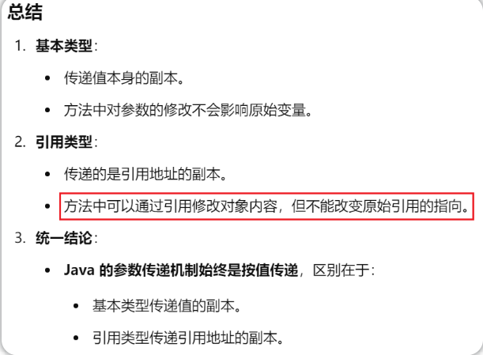
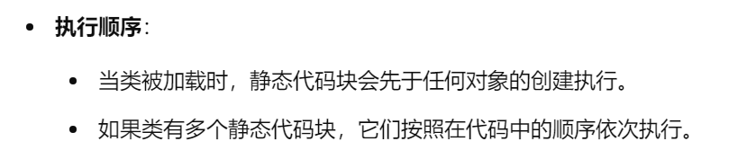
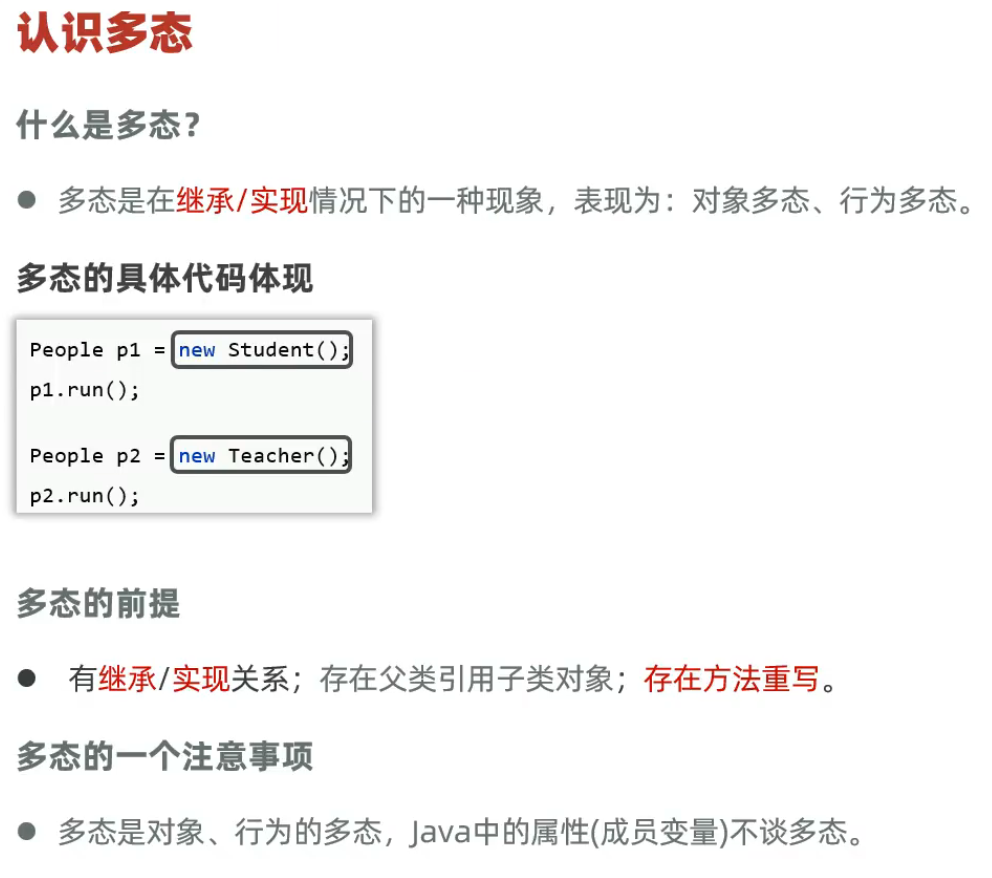

# Java背景

## Java语言特性

* JDK：Java Development Kit，Java开发者工具包
  * 

* JRE：Java Runtime Environment，Java运行环境
  * JVM：Java Virtual Machine，Java虚拟机 真正**运行Java程序**的地方
  * Java类库/核心类库：
    * **java.lang**：提供核心功能（字符串String、数学、线程等）。**默认导入**
    * **java.util**：集合框架、日期时间工具等。
    * java.io：文件读写和流操作。
    * java.net：网络通信相关。
    * java.sql：数据库连接和操作。
    * java.security：安全和加密功能。


## 代码结构


## 命名规范

* **类、接口**：大驼峰命名法。

* **方法、变量**：小驼峰命名法。
* **常量**：全大写，单词间用下划线。
* **包名**：全小写。
* **泛型**：单个大写字母。 <T>  <K> <E>
* **测试类和方法**：遵循语义清晰的规则。

# Java基础

## 基础语法

### 基本数据类型


- 二进制(Binary，以`0b` 或 `0B` 开头)，八进制(Octal，以`0` 开头)，十六进制(Hexadecimal，以 `0x` 或 `0X` 开头)
- 整型（byte-1，short-2，int-4，long-8）一律用**补码**来表示和存储，有符号数第一位为符号位。（负数的补码：负数的原码取反+1）
- 浮点型（float-4，double-8） 存储遵循  IEEE 754 标准 （了解，计算机组成原理基础内容）


> **关键字**：是 Java 语言预定义的保留字，具有特定的含义，不能用作标识符。关键字总是固定的，具有语言本身的意义。
>
> **标识符**：是程序员定义的名称，用于标识类、方法、变量等，可以根据需求进行命名。

### 类型转换和运算符

#### 类型转换 - Type Casting

> **隐式类型转换**
>
> - Java 自动将低精度类型转换为高精度类型，这种转换是安全的，不会丢失信息。
> - 自动装箱（Autoboxing）与 拆箱（Unboxing）：Java 会自动将基本类型与包装类型进行转换。(了解，int底层Integer) 
> - 万物皆对象 int <--> Integer
>
> **显式类型转换**
>
> - 通常是将大范围数据类型转换为小范围类型，这种转换需要显式声明。
> - 强制转换时，如果转换的数据超出了目标类型的范围，会导致 **数据溢出** 或 **精度丢失**。
>
> ```java
> double d = 100.99;
> int num = (int) d;  // 强制类型转换，精度丢失小数部分
> System.out.println(num); // 输出 100
> 
> int a = 1234567;
> byte c = (byte) a; // 强制类型转换，溢出
> System.out.println(c);   // 输出 -121
> ```

#### 类型提升 - Type Promotion

> 类型提升一般指表达式类型提升，指在表达式计算过程中，当涉及到不同数据类型的运算时，低精度类型会自动转换为更高精度类型
>
> 1. `byte`, `short`, `char` 会提升为 `int`。
> 2. `int` 和 `long` 运算时结果为 `long`。
> 3. `int` 和 `float` 运算时结果为 `float`。
> 4. `float` 和 `double` 运算时结果为 `double`。

#### 运算符 Operator

- 算术运算符（+，-，*，/，%）
- 赋值运算符（=，+=，-=，`*=`，/=，%=）
- 比较运算符（==，!=，\>，<，\>=，<=）
- 逻辑运算符（&&，||，！）
- 位运算符（`&`按位与，`` `按位或，`~`按位非，`^`按位异或，`<<`左移，`>>`右移）
- 三元运算符（ a > b ? "a is greater" : "b is greater" ）
- 自增和自减运算符 （++，--；注意区分`++a`和`a++`）

### 分支结构

#### if

- if
- if-(else if)-else

#### switch

- `switch` 语句支持 `byte`、`short`、`char`、`int` 以及 `String` 类型的值。
- 在 `switch` 中，每个 `case` 后面可以有一个 `break` 语句，用于跳出 `switch` 语句，防止继续执行后续的 `case` 代码。
- 穿透性：如果没有 `break`，会继续执行下一个 `case` 语句，直到遇到 `break` 或 `switch` 结束。

### 循环结构

#### for

- for (int i = 0; i < 5; i++)
- for (int num : numbers)  增强for
- for (;;) 监听一个端口

#### while

- while (i < 5)
- while (true)

#### do-while

do-while 循环 和 while循环类似，但它总是至少执行一次代码块，因为条件判断是在循环体之后。

> 这三种循环都可以通过 **`break`** 和 **`continue`** 语句进行控制：
>
> - `break` 用来退出循环
> - `continue` 用来跳过当前循环，继续下次迭代。

### 其他

#### 标准输入输出（控制台 I/O）

> 打印信息到控制台可以使用 `System.out` 对象。常见的方法有 `print()` 和 `println()`
>
> ```java
> // 源码
> public final class System {
> 	public static final PrintStream out = null;
> }
> ```
>
> ```java
> import java.util.Scanner;
> 
> public class Main {
>     public static void main(String[] args) {
>         // 创建一个 Scanner 对象来读取输入
>         Scanner scanner = new Scanner(System.in);
> 
>         System.out.print("请输入你的名字: ");
>         String name = scanner.nextLine();  // 读取一行输入
> 
>         System.out.print("请输入你的年龄: ");
>         int age = scanner.nextInt();  // 读取一个整数
> 
>         System.out.println("你好, " + name + "，你的年龄是: " + age);
> 
>         // 关闭 Scanner 对象
>         // scanner.close();
>     }
> }
> ```

#### 数组

```java
//一维数组声明
int[] arr; 
int[] arr = {1, 2, 3, 4, 5};
int[] arr = new int[4]; //arr {0,0,0,0}
//索引访问 arr[i]
//arr.length
//数组遍历  图遍历
for (int i = 0; i < arr.length; i++) {
    System.out.println(arr[i]);
}
for (int num : arr) {
    System.out.println(num);
}
---------------------------------------
//二维数组 （本质上还是一维数组，多维同理）
int[][] arr;
int[][] arr = {   //不规则数组 或 Jagged Array
    {1, 2, 3, 4},
    {5},
    {9, 10}
}; 
int[][] arr = new int[3][4];
//索引访问 arr[i][j]
//arr.length   arr[i].length
//数组遍历
for (int i = 0; i < arr.length; i++) {
    for (int j = 0; j < arr[i].length; j++) {
        System.out.print(arr[i][j] + " ");
    }
    System.out.println();
}
for (int[] row : arr) {
    for (int num : row)
        System.out.print(num + " ");
    System.out.println();
}
```

- **数组默认值** - 基本数据类型
  - `int`：0
  - `char`：`'\u0000'`（空字符）
  - `boolean`：`false`
  - `double`：0.0

```java
char[] cc = new char[5];
for (char c : cc) {
    System.out.println("'" + c + "' - Unicode值: " + (int)c);  // 输出0
}
```

- **数组默认值** - 引用类型（如 String 或 其他对象）
  - 默认值是 `null`

> 对象是类的实例（instance）。
>
> 简单来说，对象是类的具体表现，是通过类定义来创建的实际数据。
>
> `未赋值的数组 --- 默认值`
>
> `未赋值的局部变量 --- 编译错误`
>
> 
>
> Question： `int[][] arr = new int[3][];`  arr初始化结果是什么？
>
> `int[][] arr = new int[3][4];` arr初始化结果是什么？

#### 参数传递

**Java 的参数传递机制是** **“按值传递”**（Pass by Value），无论是**基本类型**还是**引用类型**，它传递的都是**值的副本**。



#### 泛型

**泛型**是 Java 提供的一种强大的机制，它允许在类、接口和方法中定义类型参数。泛型的主要目的是 **类型安全** 和 **代码复用**。通过泛型，Java 程序员可以编写更通用的代码，而不需要在编写时指定具体的类型，从而避免了类型转换的麻烦。

##### 泛型类（Generic Class）

泛型类是在类定义时使用类型参数，允许在实例化时指定类型。这样，类就能操作任何类型的数据，而不需要在编写时指定类型。

```java
// 泛型类，使用其他命名
public class Box<K> {  // K 作为类型参数
    private K value;     // 泛型类型
    private int value2;  // 普通的 int 类型

    // 设置泛型类型的值
    public void setValue(K value) {
        this.value = value;
    }

    // 获取泛型类型的值
    public K getValue() {
        return value;
    }

    // 设置 int 类型的值
    public void setValue2(int value2) {
        this.value2 = value2;
    }

    // 获取 int 类型的值
    public int getValue2() {
        return value2;
    }
}
//K 是泛型类型：它在类 Box 中作为占位符，用来表示某种类型，具体类型会在实例化时由用户指定。例如，你可以创建一个 Box<Integer> 的对象，这样 K 就会变成 Integer 类型。
//value2 是普通的 int 类型：它是一个基本数据类型，与泛型无关，完全可以在类中与泛型成员变量一起使用。
--------------------------------------------------------------------------------------
public class Main {
    public static void main(String[] args) {
        // 使用 Integer 类型替代泛型类型 K
        Box<Integer> box = new Box<>();
        box.setValue(123);  // 设置泛型类型的值
        box.setValue2(456); // 设置普通 int 类型的值

        System.out.println("泛型类型的值: " + box.getValue());   // 输出: 123
        System.out.println("普通类型的值: " + box.getValue2());  // 输出: 456
    }
}
```

##### 泛型方法（Generic Method）

泛型方法是指方法声明中包含类型参数的情况，这些类型参数是在调用方法时由具体的类型所替代的。

```java
// 泛型方法
public <T> void printArray(T[] array) {
    for (T element : array) {
        System.out.println(element);
    }
}
//在这个方法中，<T> 说明方法使用了一个类型参数 T，可以传入任意类型的数组。
```

##### 泛型接口（Generic Interface）

泛型接口是带有类型参数的接口，使用时可以定义不同的类型。

```java
// 泛型接口
public interface Pair<K, V> {
    K getKey();
    V getValue();
}
//这里 K 和 V 是两个类型参数，表示键值对。
```

| 泛型边界（泛型约束） | 即在泛型中，我们可以限制类型参数的范围。                     | 备注                                                   |
| -------------------- | :----------------------------------------------------------- | ------------------------------------------------------ |
| 上限边界             | T extends Number                                             | 表示 `T` 必须是 `Number` 类型或其子类                  |
| 下限边界             | T super Number                                               | 表示 `T` 必须是 `Number` 类型或其父类                  |
| 多重边界             | T extends Number & Serializable                              | 必须是 Number 类或其子类，并且实现了 Serializable 接口 |
| 通配符               | 通配符 `?` 是 Java 泛型中的一个特殊类型符号，用于表示任意类型 | List<?>` 表示它可以接收任何类型的 `List                |
| 上限通配符           | List<? extends Number> numbers                               | 接受 `List` 类型，它的元素必须是 `Number` 或其子类     |
| 下限通配符           | List<? super Integer> list                                   | 只允许添加 Integer 或其子类                            |

Question：`T extends Number` 和 `? extends Number`  是等价的吗？


```java
// 合法
class Box<T extends Integer> {
    private T value;

    public Box(T value) {
        this.value = value;
    }

    public T getValue() {
        return value;
    }
}
// 非法
class Box<? extends Integer> { 
    private ? value; 

    public Box(T value) {
        this.value = value;
    }

    public T getValue() {
        return value;
    }
}
```

```java
// 骚操作 （了解，工作中比较常见）
public class Box<T> {
    private T value;

    public Box(T value) {
        this.value = value;
    }

    public T getValue() {
        return value;
    }
}

// 可以将 T 限制为 super Number
Box<? super Number> box = new Box<>(123);  // Box<Number> 或 Box<Object> 都可以

// Box<? super Number> 中使用了 ? 通配符，Box 本身仍然是一个泛型类。故box实例为泛型类实例化。
// box 是一个 Box 类型的实例，但它并没有明确的类型参数，它依赖于通配符来表示类型范围
// 相比普通泛型类实例化 Box<Integer> box2 = new Box<>(456); 
```


#### 抽象类和接口

在 Java 中，**抽象类（Abstract Class）** 和 **接口（Interface）** 都是用来定义类的行为规范和结构的，它们是面向对象编程中的两个重要概念。它们的主要区别体现在 **继承方式、字段的声明、方法的实现** 等方面。

##### 抽象类 Abstract Class 

> 抽象类是不能被实例化的类，它用于提供一些方法的声明（抽象方法）和部分实现（具体方法）。抽象类的主要作用是作为其他类的基类，为其提供公共的行为和属性。
>
> 

```java
// 抽象类
abstract class Animal {
    // 抽象方法
    abstract void sound();
    
    // 具体方法
    void eat() {
        System.out.println("This animal eats food.");
    }
}

class Dog extends Animal {
    // 实现抽象方法
    @Override
    void sound() {
        System.out.println("Bark");
    }
}

class Main {
    public static void main(String[] args) {
        Animal animal = new Dog();
        animal.sound();  // 输出：Bark
        animal.eat();    // 输出：This animal eats food.
    }
}
```

##### 接口 Interface

> 接口是一种特殊的类，它用于定义一组方法的签名（方法声明），并且不提供方法的具体实现。接口在 Java 中用于定义 **行为规范**，类通过实现接口来遵循这个行为规范。
>
> 

```java
// 接口
interface Animal {
    void sound();  // 接口中的抽象方法
    
    default void eat() {
        System.out.println("This animal eats food.");
    }
}

class Dog implements Animal {
    // 实现接口中的抽象方法
    @Override
    public void sound() {
        System.out.println("Bark");
    }
}

class Main {
    public static void main(String[] args) {
        Animal animal = new Dog();
        animal.sound();  // 输出：Bark
        animal.eat();    // 输出：This animal eats food.
    }
}
```

## 面向对象程序设计 - OOP

> 面向对象编程（Object Oriented Programming, OOP）的四大基本特性通常包括 **封装**（Encapsulation）、**继承**（Inheritance）、**多态**（Polymorphism）

### 前置知识

#### static关键字

`static` 是 Java 中的一个关键字，用于声明类的成员（变量、方法、代码块和内部类）是 **静态的**。静态成员与类本身相关联，而不是与类的实例相关联。换句话说，静态成员属于类的共享部分，所有该类的实例共享这些静态成员。

`static` 关键字可以用于以下几种情况：

1. **静态变量**（Static Variables）
2. **静态方法**（Static Methods）
3. **静态代码块**（Static Blocks）              [了解]
4. **静态内部类**（Static Inner Classes）   [仅为了完整性，无需了解]

> 静态变量是属于类的，而不是类的实例。每个类的实例共享同一个静态变量。它是在类加载时就初始化的，因此不依赖于类的实例。

```java
class Counter {
    // 静态变量
    static int count = 0;
    
    // 构造器
    Counter() {
        count++;  // 每次创建对象时，count 增加
    }
    
    // 静态方法，返回当前 count 值
    static int getCount() {
        return count;
    }
}

public class Main {
    public static void main(String[] args) {
        Counter c1 = new Counter();
        Counter c2 = new Counter();
        Counter c3 = new Counter();
        
        // 输出：3，因为 count 是静态变量，所有对象共享同一份 count
        System.out.println(Counter.getCount());  // 输出: 3
    }
}
```


> 静态方法属于类，而不是类的实例。静态方法可以通过类名直接调用，也可以通过类的实例调用，但推荐通过类名调用。
>
> - 静态方法无法直接访问类的实例变量或实例方法，因为实例变量和实例方法需要对象实例来访问，而静态方法属于类。
> - 静态方法可以访问静态变量和调用静态方法。

```java
class MathUtils {
    // 静态方法
    static int add(int a, int b) {
        return a + b;
    }
    
    static int subtract(int a, int b) {
        return a - b;
    }
}

public class Main {
    public static void main(String[] args) {
        // 使用类名直接调用静态方法
        System.out.println(MathUtils.add(5, 3));  // 输出: 8
        System.out.println(MathUtils.subtract(5, 3));  // 输出: 2
    }
}
```


> 静态代码块是在类加载时执行的代码块。它们用于初始化类的静态成员，且只在类加载时执行一次。
>
> - 静态代码块在类加载时执行。
> - 类加载时执行一次，且优先于主方法 `main()` 执行。
> - 静态代码块通常用于初始化静态变量。

```java
class MyClass {
    // 静态变量
    static int value;
    
    // 静态代码块
    static {
        value = 10;  // 初始化静态变量
        System.out.println("Static block executed.");
    }
    
    // 构造器
    MyClass() {
        System.out.println("Constructor executed.");
    }
}

public class Main {
    public static void main(String[] args) {
        // 只会输出一次 "Static block executed."
        // 然后每创建一个对象都会调用构造器
        MyClass obj1 = new MyClass();  // 输出: Static block executed. Constructor executed.
        MyClass obj2 = new MyClass();  // 输出: Constructor executed.
    }
}
```



> 思考idea / Java JVM 这样设计的原因：
>
> 

#### 权限修饰符


### 封装 Encapsulation 

**封装**是将数据（属性）和对数据的操作（方法）封装在一起，限制外部直接访问类的内部数据，只能通过公开的接口（方法）来访问和修改数据。封装的目的是**数据隐藏**，保护对象的内部状态，避免外部的直接修改，减少复杂性，并且增强类的可维护性和可扩展性。

> 封装通过以下两个方式来实现：
>
> - **将类的成员变量声明为 `private`**，防止外部直接访问。
> - **提供 `public` 的 getter 和 setter 方法**，用于访问和修改 `private` 变量。()
>
> (可以安装插件[ptg](https://plugins.jetbrains.com/plugin/index?xmlId=com.ptg.quickcodegeneration.plugin&utm_source=product&utm_medium=link&utm_campaign=IU&utm_content=2023.1)来一键生成JavaBean)
>
> 封装的优点：
>
> - **数据隐藏**：外部无法直接访问对象的属性，只能通过方法访问，从而保护了数据的完整性。
> - **控制访问**：可以在 getter 和 setter 方法中增加对数据的有效性检查和逻辑控制，确保数据的一致性和安全性。
> - **增强灵活性和可维护性**：如果类的内部实现发生改变，只要不修改公开的接口，外部的代码就不会受到影响。

```java
package com.it.Demo1;

public class Person {
    private String name;
    private int age;

    // 类都有默认的无参构造
    // 但是如果手动声明了有参构造，一定要手动声明无参构造！！！
    public Person() {

    }

    public Person(String name, int age) {
        this.name = name;
        this.age = age;
    }

    public String getName() {
        return name;
    }

    public void setName(String name) {
        if (name != null && !name.isEmpty()) { // 数据有效性检查
            this.name = name;
        }
    }

    public int getAge() {
        return age;
    }

    public void setAge(int age) {
        if (age > 0) { // 数据有效性检查
            this.age = age;
        }
    }

    public void displayInfo() {
        System.out.println("Name: " + name + ", Age: " + age);
    }
}
```

### 继承 Inheritance

继承的基本作用是：

1. **代码重用**：子类可以继承父类的现有代码，避免重复编写相同的代码。
2. **扩展功能**：子类不仅能继承父类的方法和属性，还可以增加额外的功能，或者重写父类的方法来改变其行为。
3. **层次结构**：继承帮助组织和建模对象的层次结构。例如，一个“学生”类可以继承“人类”类，表示学生是人类的一种。

> - 在 Java 中，继承通过 `extends` 关键字来实现，子类通过该关键字继承父类。
> - Java只支持单继承，不支持多继承，支持多层单继承。所有的类都隐式继承Object类。
> - 子类构造器会先执行父类的无参构造器，会隐式调用super()，也可手动调用有参构造器。
>   - Question：如果父类没有无参构造器（什么情况下没有无参构造器？），子类构造器怎么办？
>
> ----
>
> 情况1：父类的无参构造器被声明为 `private`
> 情况2：父类只显式定义了有参构造器
> Answer：如果父类只有有参构造器，没有无参构造器，那么不论子类是使用无参构造器还是有参构造器，**子类都必须显式调用父类的有参构造器**。

```java
class Parent {
    String name;
    String age;

    // 父类的构造器
    public Parent(String name, String age) {
        this.name = name;
        this.age = age;
    }

    // 父类的方法
    public void speak() {
        System.out.println("I am the parent!");
    }

    // 父类的其他方法
    public void introduce() {
        System.out.println("Name: " + name + ", Age: " + age);
    }
}

class Child extends Parent {
    String schoolName;

    // 子类的使用this调用兄弟构造器
    public Child(String name, String age) {
        this(name, age, "清华大学");  //思考下 为什么必须要写在构造器第一行，且super() this()不可以同时出现
    }
    
    // 子类的构造器
    public Child(String name, String age, String schoolName) {
        super(name, age);  // 调用父类的构造器
        this.schoolName = schoolName;
    }

    // 子类继承父类的方法，并且重写了 speak 方法
    @Override
    public void speak() {
        System.out.println("I am the child!");
    }

    // 子类新增方法
    public void study() {
        System.out.println("I study at " + schoolName);
    }

    // 子类继承父类的 introduce 方法并调用
    public void childIntroduce() {
        super.introduce();  // 调用父类的 introduce 方法
        System.out.println("I study at " + schoolName);
    }
}

public class Main {
    public static void main(String[] args) {
        // 创建子类对象
        Child child = new Child("John", "12", "BUPT");

        // 子类调用父类继承来的方法
        child.introduce();  // 调用父类的 introduce 方法

        // 子类调用重写后的 speak 方法
        child.speak();  // 输出: I am the child!

        // 子类自己定义的方法
        child.study();  // 输出: I study at BUPT

        // 子类调用父类的 introduce 方法
        child.childIntroduce();
    }
}
```

> **方法重写（Override）**：子类提供父类方法的具体实现，方法签名必须与父类一致。
> **方法重载（Overload）**：在同一个类中，定义多个方法名相同但参数不同的方法，方法签名不同。
> （其实是两个完全不相关的东西，只是翻译过来有点相似）

### 多态 Polymorphism

在面向对象编程中，**多态**可以从不同的角度进行分类，通常我们将其分为 **对象多态**（Object Polymorphism）和 **行为多态**（Behavioral Polymorphism）。



#### 对象多态

>  简单来说，父类类型的引用可以指向子类的对象。
>
> - **实现方式**：父类引用可以指向子类对象，运行时根据实际对象类型来调用方法。

```java
class Animal {
    String name;

    public Animal(String name) {
        this.name = name;
    }

    public void sound() {
        System.out.println("Animal makes a sound");
    }
}

class Dog extends Animal {
    String name;  // 这里的name是子类自己的属性

    public Dog(String name) {
        super(name);  // 调用父类的构造器
    }

    @Override
    public void sound() {
        System.out.println("Dog barks");
    }
}

class Cat extends Animal {
    String name;  // 这里的name是子类自己的属性

    public Cat(String name) {
        super(name);  // 调用父类的构造器
    }

    @Override
    public void sound() {
        System.out.println("Cat meows");
    }
}

public class Main {
    public static void main(String[] args) {
        // 创建Dog和Cat对象，分别通过Animal类型的引用指向
        Animal animal1 = new Dog("修勾");
        Animal animal2 = new Cat("小猫");
        
        // 访问的sound()方法是多态的，会根据实际对象调用不同的方法
        animal1.sound();  // 输出: Dog barks
        animal2.sound();  // 输出: Cat meows

        // 访问属性name（这部分没有多态）
        // 通过父类引用访问子类的属性会访问到父类的name，无法访问到子类的name
        System.out.println("animal1's name: " + animal1.name);  // 输出: null (父类的name属性)
        System.out.println("animal2's name: " + animal2.name);  // 输出: null (父类的name属性)

        // 如果需要访问子类的属性name，需要进行类型转换
        if (animal1 instanceof Dog) {
            System.out.println("animal1's name: " + ((Dog) animal1).name);  // 输出: 修勾
        }
        if (animal2 instanceof Cat) {
            System.out.println("animal2's name: " + ((Cat) animal2).name);  // 输出: 小猫
        }
        // 多态情况下，不能调用子类独有的行为。 
        // 编译看左边   ----> 多态下进行类型转换  即：先`instanceof`再强制类型转换
        // 同上
    }
}

```

**方法多态**：当父类和子类都定义了同名方法时，子类可以重写父类的方法。在运行时，Java 会根据实际对象的类型来调用相应的重写方法，而不管引用类型是什么。这就是方法的多态。 【运行时指定】

**属性**不支持多态，子类和父类的属性是独立的，访问时不会受到多态的影响。访问父类引用的属性时，始终访问的是父类中的属性，除非通过类型转换来访问子类的属性。 【编译时指定】

#### 行为多态

行为多态指的是方法的不同实现。不同的类可以有相同的方法名称，但每个类可以有不同的实现。通常，行为多态是通过 **方法重写**（Overriding）实现的。

- **实现方式**：子类可以重写父类的方法，运行时会根据对象的实际类型来调用相应的实现方法。

```java
class Animal {
    public void sound() {
        System.out.println("Animal makes a sound");
    }
}

class Dog extends Animal {
    @Override
    public void sound() {
        System.out.println("Dog barks");
    }
}

class Cat extends Animal {
    @Override
    public void sound() {
        System.out.println("Cat meows");
    }
}

public class Main {
    public static void main(String[] args) {
        Animal dog = new Dog();  // Dog 对象
        Animal cat = new Cat();  // Cat 对象
        
        dog.sound();  // 输出: Dog barks
        cat.sound();  // 输出: Cat meows
    }
}
```


## 常用API

### String

在 Java 中，`==` 比较的是两个对象的 **引用** 是否相同（即它们是否指向同一内存位置），而 `equals()` 比较的是两个对象的 **内容** 是否相同。

```java
String str1 = new String("hello");
String str2 = new String("hello");

System.out.println(str1 == str2);  // 输出: false, 因为它们是两个不同的对象
System.out.println(str1.equals(str2));  // 输出: true, 因为它们的内容相同

-----------------------------------------------------
String str1 = "hello";
String str2 = "hello";

System.out.println(str1 == str2);  // 输出: true, 是一个对象
System.out.println(str1.equals(str2));  // 输出: true, 是一个对象
```

```java
String s = "hello world";
String result = s.substring(6);
System.out.println(result);  // 输出: world

String s = "hello world";
String result = s.substring(0, 5);
System.out.println(result);  // 输出: hello

String s = "  hello world  ";
String[] words = s.trim().split("\\s+"); 
//trim()：移除字符串两端的空白字符（空格、制表符等）。
//split("\\s+")：将字符串按照 一个或多个空白字符（如空格、Tab、换行符等）进行分割，返回一个字符串数组。
//  正则表达式 \\s+ 
//  \\s：匹配任何空白字符（包括空格、制表符、换行符、回车符等）
//  +：表示前面的元素（在这里是 \\s）重复一次或多次。即，\\s+ 匹配 一个或多个空白字符。
System.out.println(Arrays.toString(words));  // 输出: [hello, world] 

String s = "hello world";
int index = s.indexOf("world"); // 返回子字符串 subStr 在字符串 s 中第一次出现的位置。如果没有找到，返回 -1。
System.out.println(index);  // 输出: 6

//反转字符串。StringBuilder 是可变的类，可以进行反转操作，而 String 是不可变的，所以先将 String 转换为 StringBuilder，然后调用 reverse() 进行反转，最后通过 toString() 转回 String 类型。
String str = "hello";
String reversed = new StringBuilder(str).reverse().toString();
System.out.println(reversed);  // 输出: olleh

char ch = 'A';
System.out.println(Character.toLowerCase(ch));  // 输出: a
System.out.println(Character.toUpperCase(ch));  // 输出: A
System.out.println(Character.isLetterOrDigit(ch));  // 输出: true
```


### Arrays

```java
Arrays.sort(int[] a, 1, n); //注意：此方法的排序操作是 原地排序，即直接修改原数组。
Arrays.toString(int[] a);


int[] arr = {1, 2, 3, 4, 5};
int[] newArr = Arrays.copyOfRange(arr, 1, 4);
System.out.println(Arrays.toString(newArr));  // 输出: [2, 3, 4]

//数组的深拷贝和浅拷贝？
```


```java
class Person {
    String name;
    
    Person(String name) {
        this.name = name;
    }
}

public class ShallowCopyExample {
    public static void main(String[] args) {
        // 创建一个原始数组，包含对象类型的元素
        Person[] original = {new Person("Alice"), new Person("Bob")};
        
        // 使用浅拷贝
        Person[] shallowCopy = original.clone();  // shallowCopy是原数组的浅拷贝
        
        // 修改浅拷贝中的对象
        shallowCopy[0].name = "Charlie";
        
        // 打印原数组和浅拷贝数组
        System.out.println("Original array:");
        for (Person p : original) {
            System.out.println(p.name);  // 输出: Charlie, Bob
        }

        System.out.println("Shallow copy array:");
        for (Person p : shallowCopy) {
            System.out.println(p.name);  // 输出: Charlie, Bob
        }
    }
}
```


```java
public class DeepCopyExample {
    public static void main(String[] args) {
        // 创建一个原始数组，包含对象类型的元素
        Person[] original = {new Person("Alice"), new Person("Bob")};
        
        // 进行深拷贝：为每个对象创建新副本
        Person[] deepCopy = new Person[original.length];
        for (int i = 0; i < original.length; i++) {
            deepCopy[i] = new Person(original[i].name);
        }
        
        // 修改深拷贝中的对象
        deepCopy[0].name = "Charlie";
        
        // 打印原数组和深拷贝数组
        System.out.println("Original array:");
        for (Person p : original) {
            System.out.println(p.name);  // 输出: Alice, Bob
        }

        System.out.println("Deep copy array:");
        for (Person p : deepCopy) {
            System.out.println(p.name);  // 输出: Charlie, Bob
        }
    }
}
```


# Java加强

## 递归 recursion

> 方法调用自身的形式，称为方法递归

规律化递归：

- 阶乘
- 斐波那契数列（Fibonacci sequence）
- 猴子吃桃
- 汉诺塔【课后了解，一般无需掌握】

非规律化递归：

- 喝啤酒
- dfs (Depth-First-Search)
- bfs (Breadth First Search)


