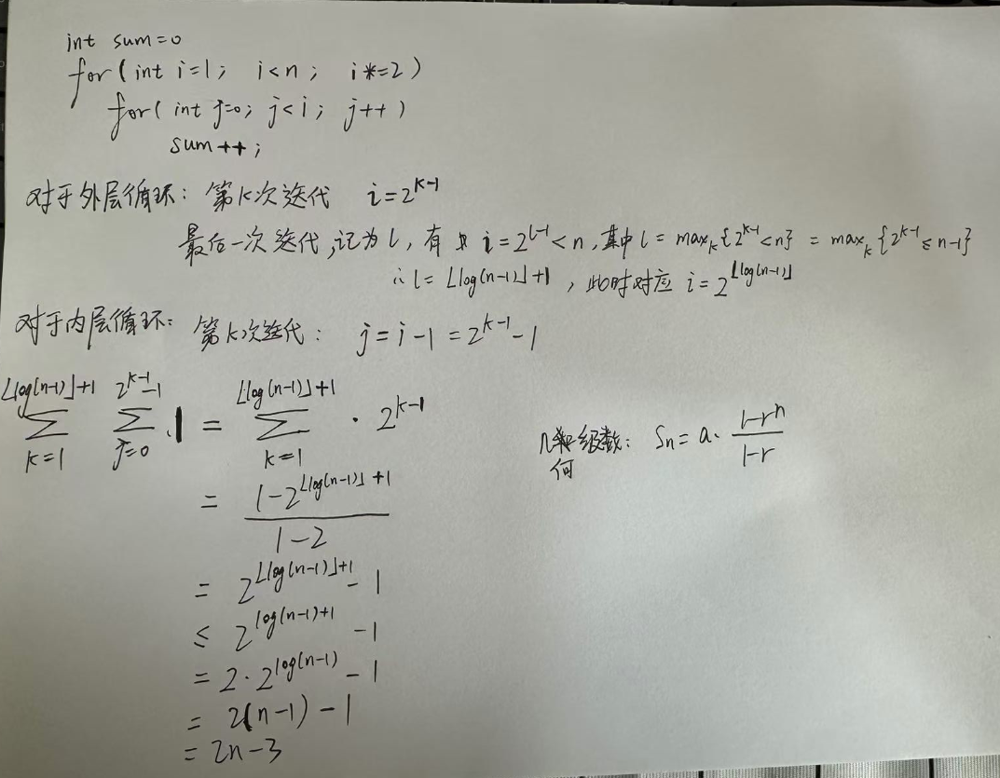

# 复杂度


> 实现了一个简单的线性查找，通过遍历数组找出目标元素 `x` 的索引。如果没有找到，返回 `-1`。
> **时间复杂度**：这个算法的时间复杂度是 `O(n)`，因为在最坏情况下需要遍历整个数组。
> **空间复杂度**：空间复杂度是 `O(1)`，因为除了输入数组和结果变量 `res` 外，算法没有使用其他额外的空间。


> 反向遍历数组的顺序，使得它可以返回 **最后一个出现的元素索引**


> 通过 res 的检查来控制循环终止条件，而不是依赖于固定的循环次数。
> 效率上没有提升。

如果数组换成有序数组，---> 二分


> **时间复杂度**：`O(log n)`，因为每次通过比较将查找范围缩小一半，这使得算法的效率非常高，适用于大规模的已排序数组。
> **空间复杂度**：`O(1)`，因为算法只使用了常数空间。
>
> ```java
> // Java实现
> public class BinarySearch {
> 
>     // 二分查找方法：查找目标值 x 在已排序数组 A 中的位置
>     public static int binarySearch(int[] A, int x) {
>         int start = 0;
>         int end = A.length - 1;
> 
>         while (start <= end) {
>             int mid = start + (end - start) / 2; // 避免溢出 为什么不直接 (start + end) / 2
> 
>             if (A[mid] == x) {
>                 return mid;  // 找到目标值，返回其索引
>             }
>             if (A[mid] < x) {
>                 start = mid + 1;  // 目标值在右半部分
>             } else {
>                 end = mid - 1;    // 目标值在左半部分
>             }
>         }
>         return -1;  // 如果找不到目标值，返回 -1
>     }
> 
>     public static void main(String[] args) {
>         // 测试用例
>         int[] sortedArray = {1, 3, 5, 7, 9, 11, 13, 15, 17, 19};  // 已排序数组
> 
>         // 查找目标值 7
>         int target = 7;
>         int index = binarySearch(sortedArray, target);
>         if (index != -1) {
>             System.out.println("元素 " + target + " 的索引是: " + index);
>         } else {
>             System.out.println("元素 " + target + " 不在数组中");
>         }
> 
>         // 查找目标值 6（不存在的元素）
>         target = 6;
>         index = binarySearch(sortedArray, target);
>         if (index != -1) {
>             System.out.println("元素 " + target + " 的索引是: " + index);
>         } else {
>             System.out.println("元素 " + target + " 不在数组中");
>         }
> 
>         // 查找目标值 19（数组中的最后一个元素）
>         target = 19;
>         index = binarySearch(sortedArray, target);
>         if (index != -1) {
>             System.out.println("元素 " + target + " 的索引是: " + index);
>         } else {
>             System.out.println("元素 " + target + " 不在数组中");
>         }
>     }
> }
> ```

## 大O表示法


## Question

```cpp
// 计算下列时间复杂度 T(n)
int sum = 0;
for (int i = 1; i < n; i *= 2)
    for (int j = 0; j < i; j++) 
        sum++;

for (int i = 1; i < n; i++)    
    for (int j = 0; j < n; j++)
        sum++;

A.O(logn) B.O(n) C.(nlogn) D.O(n^2)
```




# 递归 recursion

> 方法调用自身的形式，称为方法递归

规律化递归：

- 阶乘

- 斐波那契数列（Fibonacci sequence）

- 猴子吃桃

  - 

  - ```java
    package com.it.Demo1;
    
    public class MonkeyEatPeaches {
        public static void main(String[] args) {
            System.out.println(eatPeaches(1)); // 1534
        }
    
        public static int eatPeaches(int n) {
            if (n == 10) {
                return 1;
            }
            // f(9)/2 - 1 = f(10)
            return (eatPeaches(n + 1) + 1) * 2;
        }
    }
    ```

- 汉诺塔【课后了解，一般无需掌握】

非规律化递归：

- 喝啤酒
  - 
- dfs (Depth-First-Search)
- bfs (Breadth First Search)

## Question


> 0+1+...+(n-1) = O(n(n−1)/2) = O(n^2)


> n = 0  [0, 0]
> n = 1  [1, 0]
> n = 2  [2, 0]
> n = 3  [3, 0]
> n = 4  [4, 0]
> n = 5  [5, 0]    每次递归调用的操作是常数时间操作，数组操作也是常数时间。递归的深度为 `n`，所以时间复杂度是 **O(n)**


> 无限递归，栈溢出。 若改为 return bla3(n-1) + bla(n-2) 为二叉树式递归，O(2^n)
> ```java
> // 斐波那契数列
> static int bla3(int n) {
>     if (n <= 0) {
>         return 0;
>     } else if (n == 1) {
>         return 1;
>     } else {
>         return bla3(n - 1) + bla3(n - 2);
>     }
> }
> ```


> 奇数直接返回，偶数每次除2，递归深度为 O(log⁡n)


> 该题目存在严重越界风险。
>
> ```java
> static void fun3(int[][] arr) {
>     final int n = arr.length;
>     if (n == 0) 
>         return;
>     for(int i=0; i<n; i++)
>         if(arr[i].length != n)
>             return;
>     
>     for (int k = 0; k < n; k+=2) {
>         if (k % 2 == 0) {
>             for (int j = n - 1; j >= 0; --j) //越界风险
>                 arr[k][j] = arr[j][k];
>         } else { // else 压根走不到
>             for (int j = 0; j < Math.sqrt(n); ++j)
>                 arr[j * j][k] = arr[k - 1][j];
>         }
>     }
> }
> ```
>
> 修改后：
>
> 外层循环：n/2
> 内层循环：k % 2 == 0，n次
> 故O(n^2)


> static int fun4(int n) {
>     if (n <= 5)
>         return d; 
>     int r = 0;
>     for (int i = n; i > 2; --i)   // O(n)
>         r = (n + 8 * r) % 3;
>     return (fun4(n / 3) + fun4(n / 3 - 1) * r) % 55;
> }
>
> 递归深度 logn  每一次都是n  O(nlogn)


