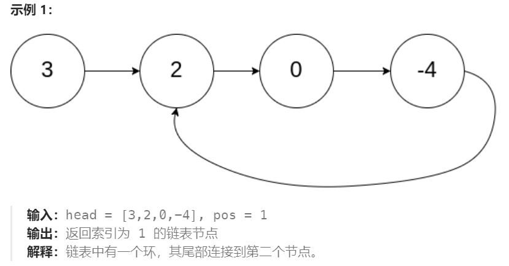

## List

### 单双链表及其反转

- 尾插法

```java
// 单链表反转 now = dummy.next   last  [尾插法]
class Solution {
    public ListNode reverseList(ListNode head) {
        ListNode dummy = new ListNode(-1, head);
        int len = 0;
        ListNode last = dummy;
        while (last.next != null) {
            len++;
            last = last.next;
        }
        if (len < 2) {
            return head;
        }
        for (int k = 1; k < len; k++) {
            ListNode now = dummy.next;
            dummy.next = now.next;
            now.next = last.next;
            last.next = now;
        }
        return dummy.next;
    }
} 
// 头插法  [先断链]
class Solution {
    public ListNode reverseList(ListNode head) {
        if(head==null || head.next==null){
            return head;
        }
        ListNode dummy = new ListNode(-1, null); //先断链
        ListNode now = head;
        ListNode next;
        while(now!=null){
            next = now.next;

            now.next = dummy.next;
            dummy.next = now;

            now = next;
        }
        return dummy.next;
    }
}


class Solution {
    public ListNode reverseList(ListNode head) {
        ListNode cur = head, pre = null;
        ListNode next;
        while(cur!=null){
            next = cur.next;
            cur.next = pre;
            pre = cur;
            cur = next;
        }
        return pre;
    }
    
    public DoubleListNode reverseDoubleList(DoubleListNode head){
        ListNode cur = head, pre = null;
        ListNode next;
        while(cur!=null){
            next = cur.next;
            cur.last = next; //last
            cur.next = pre;
            pre = cur;
            cur = next;
        }
        return pre;
    }
}
```

### [环形链表](https://leetcode.cn/problems/linked-list-cycle-ii/)



```java
public class Solution {
    public ListNode detectCycle(ListNode head) {
        ListNode dummy = new ListNode(-1, head);
        ListNode slow = dummy;
        ListNode fast = dummy;
        do {
            slow = slow.next;
            if (fast == null || fast.next == null || fast.next.next == null) {
                return null;
            }
            fast = fast.next.next;
        } while (slow != fast);
        slow = dummy;
        while (slow != fast) {
            slow = slow.next;
            fast = fast.next;
        }
        return slow;
    }
}
```

### 合并两个有序链表

```java
public ListNode mergeTwoLists(ListNode list1, ListNode list2) {
    if(list1 == null || list2 == null){
        return list1 == null ? list2 : list1;
    }
    ListNode dummy = new ListNode(-1, null);
    ListNode pre = dummy;
    while(list1!=null && list2!=null){
        if(list1.val <= list2.val){
            pre.next = list1;
            list1 = list1.next;
        }else{
            pre.next = list2;
            list2 = list2.next;
        }
        pre = pre.next;
    }
    if (list1 != null) {
        pre.next = list1;
    } else if (list2 != null) {
        pre.next = list2;
    }
    return dummy.next;
}
```

### [排序链表](https://leetcode.cn/problems/sort-list/)

``` java
class Solution {
    public ListNode sortList(ListNode head) {
        if (head == null || head.next == null)
            return head;
        //找mid
        ListNode fast = head.next, slow = head;
        while (fast != null && fast.next != null) {
            slow = slow.next;
            fast = fast.next.next;
        }
        ListNode tmp = slow.next;
        slow.next = null;  //断成两个链表
        ListNode left = sortList(head);
        ListNode right = sortList(tmp);
        return merge(left, right);
    }
    public ListNode merge(ListNode list1, ListNode list2) {
        ListNode dummy = new ListNode(-1);
        ListNode now = dummy;
        ListNode l1 = list1;
        ListNode l2 = list2;
        while (l1 != null && l2 != null) {
            if (l1.val <= l2.val) {
                now.next = l1;      
                l1 = l1.next;
            } else {
                now.next = l2;
                l2 = l2.next;
            }
            now = now.next;
        }
        if (l1 != null) {
            now.next = l1;
        }
        if (l2 != null) {
            now.next = l2;
        }
        return dummy.next;
    }
}
```

### [LRU](https://leetcode.cn/problems/lru-cache/description/) (双向链表)

- [详细题解](https://leetcode.cn/problems/lru-cache/solutions/2456294/tu-jie-yi-zhang-tu-miao-dong-lrupythonja-czgt/?envType=study-plan-v2&envId=top-100-liked)

```java
class LRUCache {

    private final int capacity;
    //LinkedHashMap 默认是插入顺序  [手动维护 最近最少未访问的顺序]
    private LinkedHashMap<Integer, Integer> cache = new LinkedHashMap<>();

    public LRUCache(int capacity) {
        this.capacity = capacity;
    }

    public int get(int key) {
        if (!cache.containsKey(key)) { // key 不在 cache 中
            return -1;
        }
        int value = cache.remove(key);
        cache.put(key, value);  // 把 key 移到链表末尾 
        return value;
    }

    public void put(int key, int value) {
        if (cache.remove(key) != null) { // key 在 cache 中
            cache.put(key, value); // 把 key 移到链表末尾
            return;
        }
        if (cache.size() == capacity) { // cache 满了
            int oldestKey = cache.keySet().iterator().next();
            cache.remove(oldestKey); // 移除最久未使用 key
        }
        cache.put(key, value);
    }
}


class LRUCache extends LinkedHashMap<Integer, Integer>{
    private int capacity;

    public LRUCache(int capacity) {
        super(capacity, 0.75F, true);
        this.capacity = capacity;
    }

    public int get(int key) {
        return super.getOrDefault(key, -1);
    }

    public void put(int key, int value) {
        // 插入或更新键值对。
        // 自动调用removeEldestEntry()
        super.put(key, value);
    }

    @Override
    protected boolean removeEldestEntry(Map.Entry<Integer, Integer> eldest) {
        return size() > capacity;
    }
}
```
