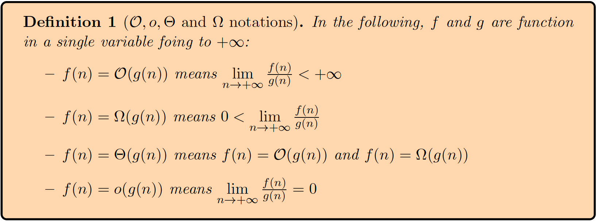

# *Statement and Notations* 声明和记号📌

* ✅对于一段文字来说,如果没有特殊标记emoji表情(如❗️等)或者==特殊颜色标记==等,了解内容即可.
* ✅反之,有上述特殊标记之一的,为重要内容,需要注重掌握.
* ✅需要整句背诵的部分,会尽可能的标记出来. (注重掌握的部分最好也背诵)

# *Complexity analysis* [时间复杂度]

## *Measuring the efficiency of programs* [测量程序的效率]

* **Time complexity** is typically proportional to the number of steps one takes by running a program by hand with pen and papers. Most operations can be assumed to take one step; some notable exceptions are allocating arrays (the time this takes is proportional to the size of the array) and calling auxiliary functions.

  * > 时间复杂度通常与用纸笔手动运行程序时所执行的步骤数量成正比。大多数操作可假定为单步完成；但存在一些明显例外，例如分配数组（所需时间与数组大小成正比）和调用辅助函数。

* **Space complexity** corresponds to the extra memory required to run a particular function on top of what was allocated for the argument. This is obtained by summing the size of the memory representation of all the variables simultaneously declared in a block of code during the execution; for an int and other basic datatypes, this will be constant, but not for complex datatypes and arrays.

  * > 空间复杂度对应于在参数分配的内存之外，运行特定函数所需的额外内存。它的计算方式是累加执行过程中在代码块内同时声明的所有变量的内存表示大小；对于 `int` 和其他基本数据类型，这个大小是固定的，但对于复杂数据类型和数组则不然。

* We abstract time/space complexity as a function that maps an input size to a running time/memory consumption. We usually consider the worst-case complexity, i.e., we take the function $n \longmapsto \max\limits_{I \text{ of size } n} \text{running time over } I$. It may be of interest to also look at average-case complexity (where the max is replaced by an expectation).

  * > 我们将时间/空间复杂度抽象为一个将输入规模映射到运行时间或内存消耗的函数。通常我们考虑最坏情况下的复杂度，即函数定义为 $n \longmapsto \max\limits_{I \text{ of size } n} I \text{上的运行时间 } $。有时研究平均情况复杂度也很有意义（此时最大值被期望值取代）
    >
    > ❗️本节课唯一的例外: 快排(quick sort)的时间复杂度最坏情况是$O(n^2)$,但是我们一般认为它的时间复杂度是$O(nlogn)$.

## Asymptotic analysis [渐进分析]

* Asymptotic means "in the limit"; it means those kind of analyses will typically only work for large value of the arguments of a function, up to a multiplicative constant.  

  * 渐近（Asymptotic）的含义是"在极限情况下"；这意味着此类分析通常仅对函数参数的大值有效（至多相差一个乘法常数）。 

* To talk about complexity analysis, we use the following notations:

  * > 对于函数 f, g: ℕ → ℝ 且当 n→+∞ 时：
    > - f(n) = $O$(g(n)) 表示 f(n) 的增长率不超过 g(n)（上确界有界）
    > - f(n) = $Ω$(g(n)) 表示 f(n) 的增长率不低于 g(n)（下极限大于零）
    > - f(n) = $Θ$(g(n)) 表示 f(n) 与 g(n) 同阶增长（同时满足 O 和 Ω）
    > - f(n) = $o$(g(n)) 表示 f(n) 的增长率严格小于 g(n)（极限为零）
    >
    > ❗️算法分析场景默认使用大$O$符号,描述**最坏情况下的性能上界**（算法运行时间/空间消耗的**最高增长级别**）,一般开发者更关心**最坏情况下系统能否扛住压力**（而非平均或最优情况）!
    >
    > 
