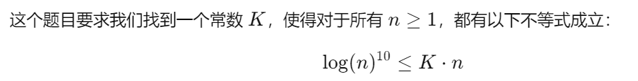
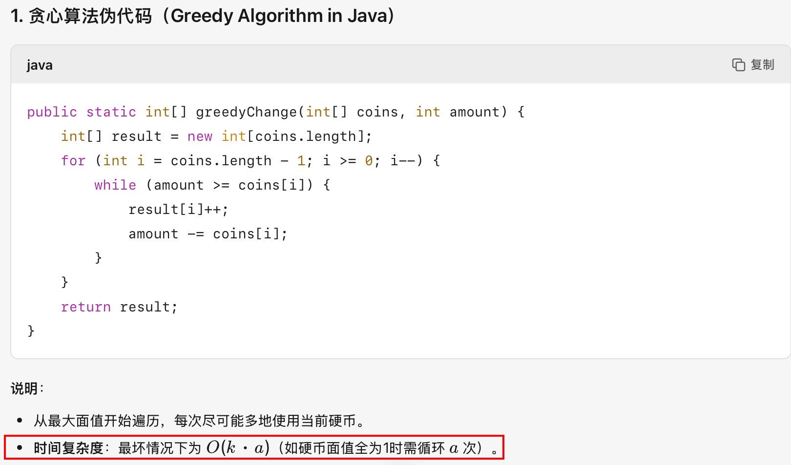

# *Statement and Notations* 声明和记号📌

* ✅对于一段文字来说,如果没有特殊标记emoji表情(如❗️等)或者==特殊颜色标记==等,了解内容即可.
* ✅反之,有上述特殊标记之一的,为重要内容,需要注重掌握.
* ✅需要整句背诵的部分,会尽可能的标记出来. (注重掌握的部分最好也背诵)

# *Complexity analysis* [时间复杂度]

## *Measuring the efficiency of programs* [测量程序的效率]

* **Time complexity** is typically proportional to the number of steps one takes by running a program by hand with pen and papers. Most operations can be assumed to take one step; some notable exceptions are allocating arrays (the time this takes is proportional to the size of the array) and calling auxiliary functions.

  * > 时间复杂度通常与用纸笔手动运行程序时所执行的步骤数量成正比。大多数操作可假定为单步完成；但存在一些明显例外，例如分配数组（所需时间与数组大小成正比）和调用辅助函数。

* **Space complexity** corresponds to the extra memory required to run a particular function on top of what was allocated for the argument. This is obtained by summing the size of the memory representation of all the variables simultaneously declared in a block of code during the execution; for an int and other basic datatypes, this will be constant, but not for complex datatypes and arrays.

  * > 空间复杂度对应于在参数分配的内存之外，运行特定函数所需的额外内存。它的计算方式是累加执行过程中在代码块内同时声明的所有变量的内存表示大小；[不计算乘法常数 4n 8n]对于 `int` 和其他基本数据类型，这个大小是固定的，但对于复杂数据类型和数组则不然。

* We abstract time/space complexity as a function that maps an input size to a running time/memory consumption. We usually consider the worst-case complexity, i.e., we take the function $n \longmapsto \max\limits_{I \text{ of size } n} \text{running time over } I$. It may be of interest to also look at average-case complexity (where the max is replaced by an expectation).

  * > 我们将时间/空间复杂度抽象为一个将输入规模映射到运行时间或内存消耗的函数。通常我们考虑最坏情况下的复杂度，即函数定义为 $n \longmapsto \max\limits_{I \text{ of size } n} I \text{上的运行时间 } $。有时研究平均情况复杂度也很有意义（此时最大值被期望值取代）
    >
    > ❗️本节课唯一的例外: 快排(quick sort)的时间复杂度最坏情况是$O(n^2)$,但是我们一般认为它的时间复杂度是$O(nlogn)$.

## Asymptotic analysis [渐进分析]

* Asymptotic means "in the limit"; it means those kind of analyses will typically only work for large value of the arguments of a function, up to a multiplicative constant.  

  * 渐近（Asymptotic）的含义是"在极限情况下"；这意味着此类分析通常仅对函数参数的大值有效（至多相差一个乘法常数）。 

* To talk about complexity analysis, we use the following notations:

  * > 对于函数 f, g: ℕ → ℝ 且当 n→+∞ 时：
    > - f(n) = $O$(g(n)) 表示 f(n) 的增长率不超过 g(n)（上确界有界）
    > - f(n) = $Ω$(g(n)) 表示 f(n) 的增长率不低于 g(n)（下极限大于零）
    > - f(n) = $Θ$(g(n)) 表示 f(n) 与 g(n) 同阶增长（同时满足 O 和 Ω）
    > - f(n) = $o$(g(n)) 表示 f(n) 的增长率严格小于 g(n)（极限为零）
    >   - 
    >
    >
    > ❗️算法分析场景默认使用大$O$符号,描述**最坏情况下的性能上界**（算法运行时间/空间消耗的**最高增长级别**）,一般开发者更关心**最坏情况下系统能否扛住压力**（而非平均或最优情况）!  快排需要考虑平均情况,我们让快排的大$O$符号取他的平均时间 O(nlogn)
    >
    > 

## 主定理（Master Theorem）


## Related Examples





> 0+1+...+(n-1) = O(n(n−1)/2) = O(n^2)


> n = 0  [0, 0]
> n = 1  [1, 0]
> n = 2  [2, 0]
> n = 3  [3, 0]
> n = 4  [4, 0]
> n = 5  [5, 0]    每次递归调用的操作是常数时间操作，数组操作也是常数时间。递归的深度为 `n`，所以时间复杂度是 **O(n)**


> 无限递归，栈溢出。 若改为 return bla3(n-1) + bla(n-2) 为二叉树式递归，O(2^n)
>
> ```java
> // 斐波那契数列
> static int bla3(int n) {
>  if (n <= 0) {
>      return 0;
>  } else if (n == 1) {
>      return 1;
>  } else {
>      return bla3(n - 1) + bla3(n - 2);
>  }
> }
> ```


> 奇数直接返回，偶数每次除2，递归深度为 O(log⁡n)


> 该题目存在严重越界风险。
>
> ```java
> static void fun3(int[][] arr) {
>  final int n = arr.length;
>  if (n == 0) 
>      return;
>  for(int i=0; i<n; i++)
>      if(arr[i].length != n)
>          return;
> 
>  for (int k = 0; k < n; k+=2) {
>      if (k % 2 == 0) {
>          for (int j = n - 1; j >= 0; --j) //越界风险
>              arr[k][j] = arr[j][k];
>      } else { // else 压根走不到
>          for (int j = 0; j < Math.sqrt(n); ++j)
>              arr[j * j][k] = arr[k - 1][j];
>      }
>  }
> }
> ```
>
> 修改后：
>
> 外层循环：n/2
> 内层循环：k % 2 == 0，n次
> 故O(n^2)


> static int fun4(int n) {
>  if (n <= 5)
>      return d; 
>  int r = 0;
>  for (int i = n; i > 2; --i)   // O(n)
>      r = (n + 8 * r) % 3;
>  return (fun4(n / 3) + fun4(n / 3 - 1) * r) % 55;
> }
>
> 递归深度 logn  每一次都是n  O(nlogn)





> 5 0 3


question 4 暂时跳过, 分治算法一般就是递归树 树的高度是logn --->  nlogn


# Techniques for coming up with algorithms [提出算法的技术]

## *Recursion* [递归]

| 英文                                                         | 中文                                                         |
| ------------------------------------------------------------ | ------------------------------------------------------------ |
| **A function implementation is called recursive when the function calls itself during execution. It could be in the body of the function, or, in the case of mutually recursive functions, in another function.** | **当函数在执行过程中调用自身时，该函数的实现称为“递归”。这种调用可以出现在函数体内部，或者（对于相互递归的函数）出现在另一个函数中。** |
| **To terminate, recursive functions will typically call themselves on strictly smaller arguments. ** 往递归出口(终止条件)去努力. | **为了保证终止，递归函数通常会在“严格更小”的参数上调用自身。** |
| **When programming, recursion is essentially as powerful as iteration (loops). Choosing one over the other in a first implementation is mostly a matter of convenience. Recursion can be used to more easily implement some control flows, and compiling recursive functions into iterative ones is typically a bit more challenging than the other way around (essentially because one needs to maintain a stack structure to emulate the function calls).** | **在编程中，递归的功能本质上与迭代（循环）同等。在首次实现时选择哪种方式主要取决于便利性。递归可以更轻松地实现某些控制流，而将递归函数编译为迭代形式通常比将迭代改写为递归更具挑战性——这是因为需要维护一个栈结构来模拟函数调用。** |
| **Recursion can lead to some natural solutions using the following recipe: if I can solve small instances of my problem, and for any big instance, I can solve it assuming that I can solve all strictly smaller instances, then I can solve all instances.** | **递归能产生一些自然的解法，可按以下“套路”进行：如果我能解决问题的所有小规模实例，并且对于任何大规模实例，在假设我已能解决所有严格更小的实例的前提下也能解决它，那么我就能解决所有实例。** |

## *Dynamic programming/memoization* [动态规划 / 记忆化]

| 英文                                                         | 中文                                                         |
| ------------------------------------------------------------ | ------------------------------------------------------------ |
| Sometimes, there is a natural recursive solution that would have ==**redundant recursive calls**==. | 有时候存在一种自然的递归解法，但会产生**冗余的递归调用**。   |
| **Dynamic programming or memoization is essentially the technique that consists in avoiding these kind of redundant calls.** | **动态规划或记忆化，本质上是一种用于避免此类冗余调用的技术。** |


| 英文                                                         | 中文                                                         |
| ------------------------------------------------------------ | ------------------------------------------------------------ |
| **One easy way of doing it is modifying the recursive function by looking up in a table before doing a recursive call. On the above example it may be done as follows:** | **一种简单的做法，是在每次递归调用前先在表中查找，其实现在上面的例子中可按如下方式实现：** |
| **One may use ArrayList and static variables to get cleaner implementations. If the input is a complex datatype, using a hash table for memoization is a good solution.** | **可以使用 ArrayList 和 static 变量来获得更简洁的实现；若输入为复杂数据类型，则使用哈希表来做记忆化是一个很好的方案。** |
| **The complexity analyses are typically less straightforward to carry to compute accurate bounds; usually the idea is to sum the contribution of each subinputs.** | **复杂度分析通常不那么直观，难以给出精确界；一般思路是把每个子输入的贡献累加起来。** |


| 英文原文                                                     | 中文翻译                                       |
| ------------------------------------------------------------ | ---------------------------------------------- |
| **Sometimes one can also use that as inspiration to get iterative implementation like the following:** | **有时也可以以此为灵感，得到如下的迭代实现：** |


# Sorting algorithm [排序算法]

## concepts [概念]

| 英文                                                         | 中文                                                         |
| ------------------------------------------------------------ | ------------------------------------------------------------ |
| **Sorting makes sense for several datastructures such as arrays and lists.** | **对数组和列表等多种数据结构进行排序是有意义的。**           |
| **One can sort arrays of integers, but also complex datatypes if a custom comparison function is provided (i.e. something extending a Comparable interface in Java).** | **可以对整数数组排序，也可以对复杂数据类型进行排序，前提是提供了自定义比较函数（例如在 Java 中扩展 Comparable 接口的类）。** |
| **Sorting by comparisons is necessarily Ω(n log(n)).**       | **基于比较的排序在最优情况下也必然需要 Ω(n log n) 的时间复杂度。** |
| **If one only needs to sort according to a restricted range of integers, there are linear-time sorting algorithms.** | **如果只需要对限制范围内的整数进行排序，则存在线性时间的排序算法。** |
| **A sorting algorithm is \*in-place\* if it does not require allocating any new arrays/collections of non-constant size; those algorithms typically operate with space complexity O(log(n)).** | **如果排序算法不需要分配任何新的、大小非固定的数组或集合，则称其为“就地”排序；这类算法通常具有 O(log n) 的空间复杂度。** |

## Classic sort algorithm [经典算法]

> 核心的思想 + 时间/空间复杂度
>
> 插入排序: 维护一个已排序的子数组,每次从未排序的子数组里面选一个最小(升序排序)的数,追加到已排序的子数组里,直至已排序的子数组的长度为整个数组长度. O(n^2) O(1)
>
> 

| 英文原文                                                     | 中文翻译                                                     |
| ------------------------------------------------------------ | ------------------------------------------------------------ |
| **Insertion sort** is a quadratic sorting algorithm that works using an auxiliary function that inserts an element in an already ordered collection. This is fairly efficient in practice over small linked lists. | **插入排序** 是一种二次时间排序算法，通过辅助函数将元素插入到已排序的集合中来工作。在小规模链表上，该方法在实践中相当高效。 |
| Over arrays, **bubble sort** is another simple quadratic-time sorting algorithm. | 在数组上，**冒泡排序** 是另一种简单的二次时间排序算法。      |
| **Merge sort** is a divide-and-conquer sorting algorithm which relies on a linear-time merging procedure. Its running-time is Θ(n log n). If the input and output is a linked list, this can be done in-place. This is a stable sorting algorithm. | **归并排序** 是一种分治法排序算法，依赖于线性时间的合并过程。其运行时间为 Θ(n log n)。若输入和输出均为链表，则可就地完成。它是一种稳定排序。 |
| **Quicksort** is another divide-and-conquer sorting algorithm which first picks a distinguished pivot and recursively sorts the elements smaller and larger than the pivot. It is easy to implement it in-place if the pivot selection strategy is simple. The worst case running time is quadratic (attained for an already-sorted input), but on average this runs in Θ(n log n). | **快速排序** 是另一种分治法排序算法，先选取一个主元，然后递归地对主元两侧的较小和较大元素进行排序。若主元选择策略简单，很容易实现就地排序。最坏情况下（如输入已排序）运行时间为二次，但平均情况下为 Θ(n log n)。 |
| **Heapsort** is a sorting algorithm that amounts to inserting all the elements of the input in a min-heap and then extracting the root repeatedly to construct the sorted output. This works in Θ(n log n) and is easy to implement in-place in an array. | **堆排序** 是一种排序算法，将所有输入元素插入最小堆，然后反复取出堆顶构造有序输出。其运行时间为 Θ(n log n)，且在数组上易于实现就地排序。 |
| **Counting sort** is a non-comparison sorting algorithm that counts the occurrences of each key and computes positions to place elements in **linear time**. | **计数排序** 是一种非比较排序算法，通过统计每个键的出现次数并计算元素在输出中的位置，实现在**线性时间**内排序。 |

> 1. **频率统计**：遍历数组，向 HashMap 插入或更新频率，耗时 O(n)（HashMap 的 get/put 平均 O(1)）。
> 2. **键排序**：把 K 个不同的键收集到 List，再用 Collections.sort 排序，耗时 O(K log K)。
> 3. **输出重建**：遍历排序后的键并按频次填充原数组，耗时 O(n)。
>
> → 总体：O(n + K log K)。最坏情况K=n 那么就是O(nlogn)的
>
> - 当 K （不同值的个数）很小（例如常数级）时，可以近似看作 O(n)；
> - 但在最坏情况下 K≈n 时，就退化到 O(n log n)，不再是线性。
>
>
> 拓展: 
>
> 如果想要做到真正的线性（O(n + M)，M 为键值范围大小），就要用「直接索引计数」的方式，而不是先把键收集再排序 最坏情况[-intmax ~ intmax]
>
> 如果待排序元素的**键值范围非常有限**（例如只在 0~100 之间），计数排序常常是最快的方案。

## Examples

### 插入排序 (Insertion Sort)

- **核心思想**：将数组分为已排序和未排序两部分，每次从未排序部分取出一个元素，插入到已排序部分的正确位置。
- 步骤：
  1. 从第二个元素开始（第一个元素默认已排序）。
  2. 将当前元素与已排序部分的元素从后向前比较。
  3. 如果当前元素更小，则将已排序元素向后移动一位。
  4. 找到合适位置后插入当前元素。
  5. 重复直到所有元素排序完成。


### 冒泡排序 (Bubble Sort)

- **核心思想**：通过多次遍历数组，每次比较相邻元素并交换顺序错误的元素，将最大元素“冒泡”到数组末尾。
- 步骤：
  1. 从数组的第一个元素开始，依次比较相邻的两个元素。
  2. 如果前一个元素大于后一个元素，则交换它们。
  3. 每次遍历会将当前未排序部分的最大元素放到正确位置。
  4. 重复直到所有元素排序完成。


### 归并排序 (Merge Sort)

- **核心思想**：分治法。将数组分成两半，分别排序后合并。
- 步骤：
  1. 递归地将数组分成两半，直到每个子数组只有一个元素。
  2. 合并两个已排序的子数组：
     - 创建一个临时数组，依次比较两个子数组的元素，将较小的放入临时数组。
     - 将剩余元素直接放入临时数组。
  3. 重复合并直到整个数组排序完成。


### 快速排序 (Quick Sort)

- **核心思想**：分治法。选择一个“基准”元素，将数组分为比基准小和比基准大的两部分，递归排序。
- 步骤：
  1. 选择一个基准元素（通常为第一个或最后一个元素）。
  2. 分区：将比基准小的元素移到左边，比基准大的移到右边。
  3. 递归地对左右两部分进行快速排序。
  4. 合并时无需额外操作，因为分区后基准已在正确位置。


#### 堆排序 (Heap Sort)

- **核心思想**：利用堆数据结构（完全二叉树），将数组构建为大顶堆，然后依次取出堆顶元素（最大值）并调整堆。
- 步骤：
  1. 构建大顶堆：从最后一个非叶子节点开始，调整堆使其满足父节点大于子节点。
  2. 交换堆顶元素（最大值）与末尾元素，缩小堆的范围。
  3. 重新调整堆，使其满足大顶堆性质。
  4. 重复直到所有元素排序完成。


### 计数排序（Counting Sort）

* **核心思想**：计数排序是一种非比较排序算法，适用于**整数数据且范围较小**的情况。
* 步骤：
  1. **统计频率**：统计数组中每个元素的出现次数。
  2. **提取并排序键**：将哈希表的键（唯一元素）提取出来并排序。
  3. **填充结果**：根据统计信息将元素放到正确位置。


# *Trees*

## Tree basic


* **Variations**: Bounding the number of nodes, not caring about the order of children, different kinds of labellings...

  * > **变体**：限制节点数量、忽略子节点顺序、不同标签类型……

* On a mathematical level, trees can be characterized as those undirected graphs with a designated root vertex and with* *exactly one path between any two vertices.

  * > 在数学层面，树可定义为无向图，其具有一个指定的根顶点，且任意两顶点间有且仅有一条路径。

## *Representation in OO[Object-oriented 面向对象] languages*


> 完全二叉树 可以用数组来表示   比如 2i+1
>
> 完全三叉树 也可以用数组来表示   即  3i+1

- **数组表示**：  
`[1, 10, 2, 51, null, 3, 88]`  
- `0`: 1（根）  
- `1`: 10（1的左子）  
- `2`: 2（1的右子）  
- `3`: 51（10的左子）  
- `4`: null（10的右子，空缺）  
- `5`: 3（2的左子）  
- `6`: 88（2的右子） 

 

**优缺点对比**

| **优点**                                     | **缺点**                                   |
| -------------------------------------------- | ------------------------------------------ |
| ✅ **O(1)快速访问**：通过索引直接定位节点     | ❌ **内存浪费**：空缺位置需用 `null` 填充   |
| ✅ **适合满层树**（如堆结构,完全二叉树,满树） | ❌ **动态扩展成本高**：插入/删除需移动元素  |
| ✅ **缓存友好**：连续内存提升访问效率         | ❌ **非满树效率低**：稀疏树导致大量空间闲置 |

## *Tree-like datastructures*


> **定义4（最小堆）**：最小堆是一种满足以下条件的二叉树：
>
> - 每个节点的标签值**小于**其子节点的标签值。
> - 除最后一层外，所有层必须完全填满。
> - 最后一层从左到右填充，直到某个节点为止。
>   最小堆支持在**对数时间**​（与堆的深度成正比）内插入和删除根节点。


> **定义5（二叉搜索树）**：二叉搜索树是一种用整数标记的二叉树，满足：
>
> - 对任意节点，其左子节点值 *l*≤*x*≤ 右子节点值 *r*。
>   更高级的结构（如AVL树、红黑树）能保持树深度为对数级，从而支持插入、删除、查找等操作在 O(log n) 时间内完成（如Java中的 `TreeSet` 类）。
>
> 

## *Dynamic arrays*


> 基于数组的覆盖结构，采用智能内存管理策略。
>
> 不变量：internalArray 的容量为 2^⌈log₂(size)⌉（即不小于 size 的最小2的幂次方）。
>
> **关键点**：
>
> - **动态扩容**：当插入元素超出当前容量时，内部数组会按2的幂次扩容（如 `size=5` 时容量扩至8）。
> - **内存效率**：避免频繁重新分配内存，平衡空间与时间开销。


> - 单次插入元素的最坏时间复杂度为 **O(n)**（因需扩容和复制数据）。
> - 插入操作的**摊还复杂度**为 **O(1)**（均摊到每次操作后接近常数时间）。
> - 其他操作（如访问）与普通数组相同（**O(1)**）。


> **示例**：
>
> - 初始容量为4
>   - 插入 `7`：无需扩容（`size=3 ≤ capacity=4`）。
>   - 插入 `8`：触发扩容（`size=5 > capacity=4`），新容量为8，==复制旧数据到新数组==。


## *Linked lists*


> **核心思想**：内存中的非连续存储便于快速删除和插入。
> ​**定义6（递归定义）​**​：
> 链表是以下两种形式之一：
>
> - 表示空列表的标志，**或**
> - 包含值和对子链表的引用的单元。
>
> **关键点**：
>
> - **非连续内存**：节点通过指针动态连接，无需预分配连续空间。
> - **递归结构**：与树类似，但每个节点只有**一个后继**（单链表）。

### Doubly-Linked List


> **常用术语**：
>
> - **头节点（Head）**：第一个单元的值。
> - **尾链（Tail）**：链表的剩余部分。
>
> **双向链表(Doubly-Linked List) --- 扩展功能**：
>
> * **O(n) 或者 O(1) 反转链表 **
>   * 
>   * 
> * **O(n) O(1) 获取长度**
>   * 
> * **O(n) O(1) 连接链表（Concatenation）**
>   * 
> * 


## *Queues, stacks and priority queues*


> **栈**是一种存储元素并支持两种操作的数据结构：
>
> - **入栈（Push）**：在顶部添加元素。
> - **出栈（Pop）**：提取最新插入的元素。
>   它以**后进先出（LIFO）​**的方式处理数据。
>
> **队列**的接口与栈对称：
>
> - **入队（Enqueue）**：在末尾添加元素。
> - **出队（Dequeue）**：提取最早插入的元素。
>   它以**先进先出（FIFO）​**的方式处理数据。
>
> **优先队列**在队列基础上扩展： --- 可以用堆heap来实现
>
> - **带优先级入队**：通过整数参数指定元素优先级。
> - **出队**：移除**优先级最低的元素中最旧的一个**。
>
> 


# 软件工程

## Catch exceptions - 案例


## Test case - 案例


