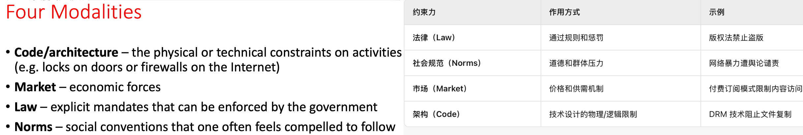
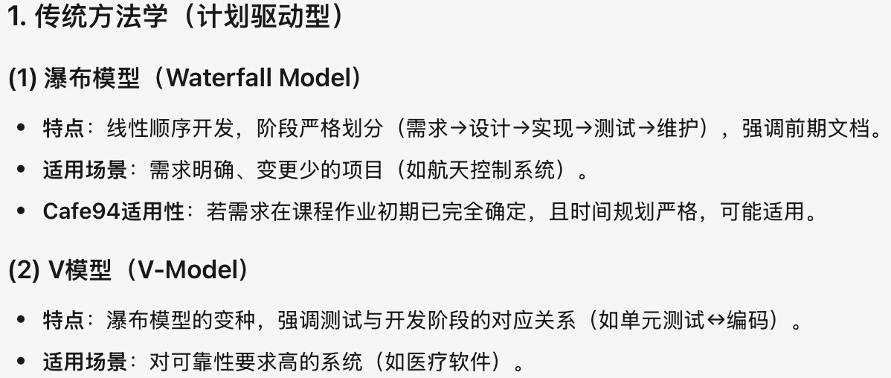
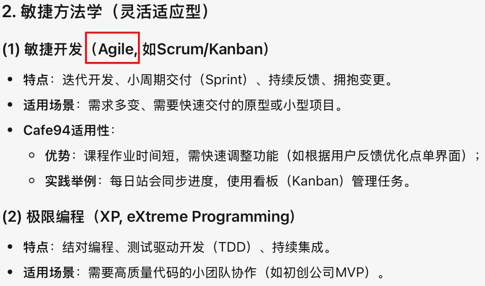
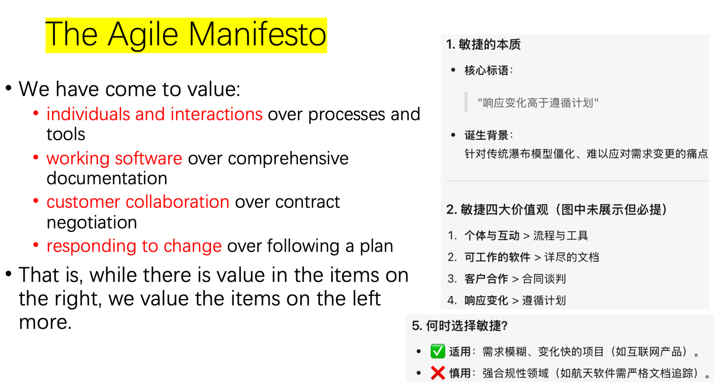
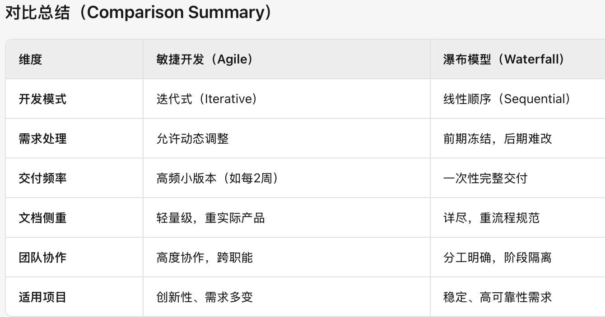
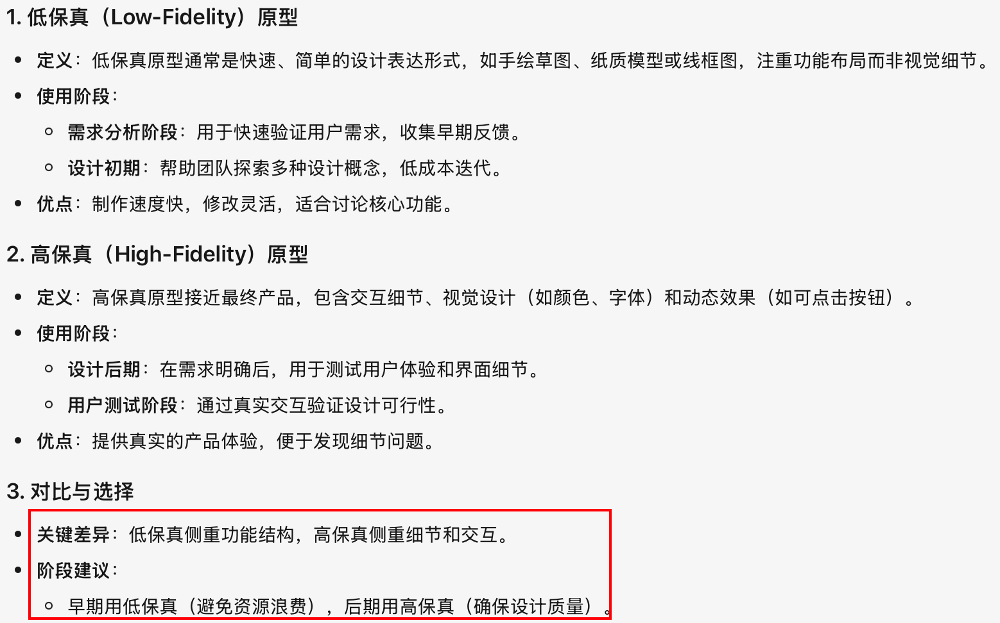
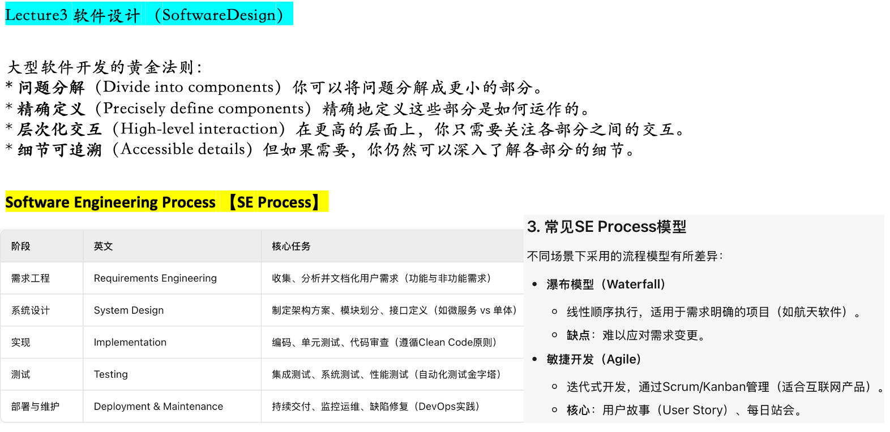

# CSCM94

- 下列内容如果是中英文对照的话,是复习的重点.
- 仅中文,则是为了辅助理解,了解即可.

## 概念题 (需要背诵)

### ==Lessig's Four Modalities== of Regulation [莱斯格的四种规约]

> 2022-Q1(a) 
>
> 2023-Q1(a) 

### ==Software Methodology== [软件方法学]

**软件方法学（Software Methodology）** 指的是在软件开发过程中用于指导团队组织、设计、实施和管理项目的系统化框架或方法论。不同的方法学定义了开发流程、角色分工、文档规范和质量控制方式，旨在提高效率、降低风险并确保软件质量。以下是常见的几类软件方法学及其特点：

#### 敏捷开发(==Agile==)

**Agile Development** is an iterative and incremental approach to software development that emphasizes flexibility, collaboration, and customer feedback. It focuses on delivering small, functional increments of software in short cycles (called *Sprints*), allowing teams to adapt to changing requirements.

> 敏捷开发是一种迭代式和增量式的软件开发方法，强调灵活性、协作性和客户反馈。它专注于在短周期（称为冲刺）内交付小的、功能性的软件增量，使团队能够适应不断变化的需求。

| 核心特点                                                     | Key Features                                                 |
| ------------------------------------------------------------ | ------------------------------------------------------------ |
| **迭代开发**：将项目拆分为多个短周期（如2-4周），每个周期交付一个可运行版本。 | **Iterative Development**: Breaks the project into short cycles (e.g., 2-4 weeks), each delivering a functional version. |
| **持续反馈**：客户或用户在每个迭代后提供反馈，指导后续开发。 | **Continuous Feedback**: Customers/users provide feedback after each iteration to guide improvements. |
| **拥抱变化**：需求可以动态调整，适应不确定性。               | **Embrace Change**: Requirements can evolve, adapting to new insights. |
| **团队协作**：跨职能团队（开发、测试、产品）紧密合作，每日站会同步进度。 | **Team Collaboration**: Cross-functional teams (dev, test, product) work closely, with daily stand-up meetings. |
| **轻量级文档**：更注重可运行软件而非详尽文档。               | **Lightweight Documentation**: Prioritizes working software over comprehensive documentation. |

**适用场景（Best Use Cases）**

* Projects with unclear or potentially frequent changes in requirements (such as startup products, course assignments).

* Scenarios requiring rapid delivery and validation of ideas.

* Small team collaboration with an emphasis on communication efficiency.

> - 需求不明确或可能频繁变更的项目（如初创产品、课程作业）。
> - 需要快速交付和验证想法的场景。
> - 小团队协作，强调沟通效率。

#### Agile Manifesto [敏捷宣言]

#### 瀑布模型 (WaterFall Model)

The **Waterfall Model** is a linear and sequential approach to software development, where each phase (e.g., requirements, design, implementation, testing) must be completed before moving to the next. Changes after a phase is finalized are costly.

> 瀑布模型是一种线性和顺序的软件开发方法，其中每个阶段（例如需求、设计、实现、测试）必须在进入下一阶段之前完成。在某一阶段完成后进行更改将代价高昂。

| **核心特点**                                           | **Key Features**                                             |
| ------------------------------------------------------ | ------------------------------------------------------------ |
| **阶段严格划分**：需求→设计→编码→测试→维护，不可逆。   | **Sequential Phases**: Requirements → Design → Implementation → Testing → Maintenance (no going back). |
| **文档驱动**：每个阶段需完成详细文档（如需求规格书）。 | **Documentation-Driven**: Requires comprehensive docs (e.g., SRS) at each stage. |
| **前期规划**：需求必须在开始前完全明确。               | **Upfront Planning**: All requirements must be defined before development starts. |
| **变更困难**：后期修改需求会导致高成本返工。           | **Rigid to Changes**: Late-stage changes are expensive and disruptive. |
| **适合稳定需求**：适用于目标明确、技术成熟的项目。     | **Predictable Projects**: Best for stable requirements and mature technologies. |

**适用场景（Best Use Cases）**

* Projects with clear requirements and almost no changes (such as government compliance systems).

* Large-scale projects with strict requirements for documents and processes (such as aerospace software).

* Ample time budget, without the need for frequent delivery updates.

> - 需求明确且几乎不会变更的项目（如政府合规系统）。
> - 对文档和流程要求严格的大型工程（如航空航天软件）。
> - 时间预算充足，无需频繁交付更新。

### Software Crisis [软件危机]

The term "Software Crisis" refers to problems in software development such as cost overruns, schedule delays, poor quality, and difficulty in maintenance, leading to failure in meeting user requirements or project delivery. This concept emerged in the 1960s when traditional development methods struggled to cope with increasing software complexity, revealing a significant gap between productivity and growing demands.

>  “软件危机”指在软件开发过程中出现的成本超支、进度延迟、质量低劣、难以维护等问题，导致软件无法满足用户需求或交付失败的现象。这一概念源于1960年代，随着软件复杂度提升，传统开发方法难以应对，暴露出生产力与需求增长的巨大差距。

**减轻软件危机影响的方法（Methods to Reduce the Impact of Software Crisis）**

In software engineering projects, the following approaches can be employed to mitigate these issues:

- **Structured & Modular Design**: Break down complex systems into independent modules (e.g., Object-Oriented Programming).
- **Adopt Best Practices**: Requirements analysis, version control (Git), automated testing (CI/CD), and code reviews.
- **Iterative Development Models**: Agile or Spiral models for rapid iterations, adapting to changes and reducing risks.
- **Formal Methods & Tools**: UML modeling, static analysis tools, etc., to improve design rigor.
- **Project Management Optimization**: Resource planning, Scrum/Kanban for team coordination.

### **功能需求 vs. 非功能需求 [==Functional== vs. ==Non-Functional Requirements==]**

**功能需求（Functional Requirements）**

Functional requirements specify what the system must do, describing its behaviors or responses to inputs.

Examples:

* User login (validate credentials).
* E-commerce cart (add items, calculate total).
* Bank transfer (verify accounts, execute transaction).

> 功能需求定义了软件系统**必须执行的具体功能或行为**，通常描述系统如何响应用户输入或外部事件。
>
> 示例:
>
> - 用户登录系统（输入用户名和密码，验证身份）。
> - 电商平台的购物车功能（添加商品、计算总价）。
> - 银行转账（验证账户、执行转账、生成交易记录）。

**非功能需求（Non-Functional Requirements）**

Non-functional requirements define **constraints or quality attributes** of the system (how it should perform).

Examples:

- **Performance**: Response time ≤2 seconds.
- **Security**: Data encryption in transit.
- **Usability**: Multi-language UI support.
- **Scalability**: Handle 100K concurrent users.

> 非功能需求定义了系统**运行的约束条件或质量属性**，关注“如何运行”而非“做什么”。
>
> 示例:
>
> - **性能**（Performance）：响应时间 ≤2秒。
> - **安全性**（Security）：数据加密传输。
> - **可用性**（Usability）：界面支持多语言。
> - **可扩展性**（Scalability）：支持10万并发用户。

### **Refactoring** [重构]

Refactoring refers to improving the internal structure of code without changing its external behavior, aiming to enhance readability, maintainability, and scalability.

> 重构是指在不改变代码外部行为的前提下优化其内部结构，以提高可读性、可维护性和可扩展性。

**重构的时机（When to Refactor）**

Refactoring should occur during:

- Adding new features (to simplify integration).
- Code reviews (to fix poor design).
- Bug fixes (if the issue stems from bad code structure).
- Continuous integration (small, incremental improvements).

> 重构应在以下时机进行：
>
> - 添加新功能时（便于集成）。
> - 代码审查时（修复不良设计）。
> - 修复缺陷时（若问题源于代码结构问题）。
> - 持续集成中（小规模渐进式优化）。

**典型重构活动（Typical Refactoring Activities）**

Examples include renaming variables/methods for clarity and extracting reusable code into separate methods.

> 典型活动包括重命名变量/方法以提高清晰度，以及提取重复代码为独立方法。

### **低保真（Low-Fidelity）** & **高保真（High-Fidelity）**

Low-fidelity prototypes (e.g., sketches) are used early in the process to validate requirements and explore ideas quickly. High-fidelity prototypes (e.g., interactive mockups) are used later to refine UI/UX details. Low-fi saves time during initial design, while high-fi ensures accuracy before development.

> 

### SE Process (Software Enginnering Process, 软件工程开发流程)

## 画UML图

###  ==Class Diagram== 类图

历年题目

### ==Use Case Diagram== 用例图

历年题目

## 代码分析题

历年题目
